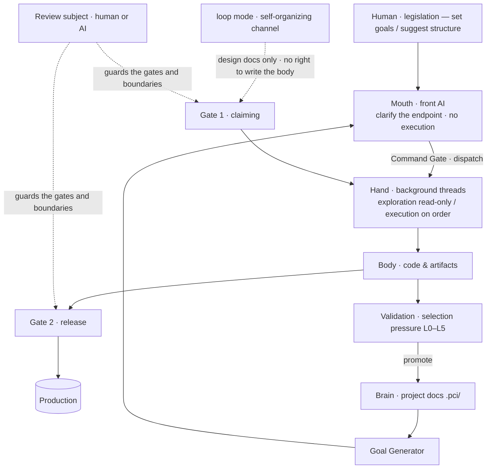

# DolphinMind

> **A Project-Centric Intelligence (PCI) Runtime** — let the project be the subject of long-term intelligence, and let the AI model be a swappable engine.
> Underlying paradigm: Domain-Separated Controlled Self-Boot Agent Architecture (BaijiMind) · controlled self-boot · fully auditable · MIT License

English | [中文](README.md)

⚠️ Note: this project is currently at the **v0.1** stage. Its doctrine and architecture are still evolving and have not been validated in large-scale production environments; assess the risk yourself before deploying. Delivery plan: see [Roadmap](#-roadmap) below.

📌 Current status: concept & doctrine stage, implementation in progress — the repository's core is the [Project-Centric Intelligence doctrine](docs/project-centric-intelligence.md). The doctrine describes a **thinking framework and a target form**, not capabilities already implemented.

## Introduction

The basic subject of long-term intelligence is not an AI agent, but the **Project**. A project continuously owns knowledge, state, experience, strategy and documentation; the LLM is merely a swappable engine. Through the loop "execute → feedback → experience → validation → strategy → execute again", the project accumulates intelligence and self-organizes, growing from completing a single task into a digital organization capable of running a company.

```text
Goal:      goal → execute → done → end.
PCI:       Project → Goal → Work → Feedback → Experience → Validation → Strategy → new Goal.
```

The Goal is what the project is doing right now; **the Project is the subject of long-term intelligence**.

## 🧭 Core Propositions

- **Project as Subject** — the project is the long-term subject.
- **Model as Engine** — the model is a swappable engine.
- **Project Continual Intelligence** — the project's past changes its future behavior.
- **Experience Capitalization** — experience becomes the project's digital capital.
- **Crystallization Ladder** — ReAct explores → Workflow solidifies the process → domain crystallization: the process is solidified together with the domain that carries it.
- **Self-Evolution** — evolving the steering files, workflows and meta-rules.
- **Documentation as Protocol** — documentation is the project intelligence's interface.
- **Validation as Selection Pressure** — no validation, no entry into strategy.

Three supplements:

- **Subject as Legal Person** — a subject is the bearer of rights and responsibilities; a human can be a subject, and so can an AI.
- **Controller is Swappable** — the reviewer need not be human; putting an independent AI behind the gate is still controlled.
- **Body Self-Boots, Brain is Governed** — artifacts may grow autonomously; the constitution, architecture and constraints must go through proposals.

## 🗺 System Overview

The core idea in one sentence: **how should production be organized so that humans and AI coordinate and play their distinct roles — supporting large-scale autonomous production and high-speed self-boot evolution, while remaining fully controllable and never spiraling out of control?**

Vision: **intelligence grows freely, order remains permanently controllable** — building a "controllably free" enterprise-grade agent runtime.



> How to read: the **Mouth** never enters the field — it only forces intent into measurable completion conditions; the **Hand** has read-only exploration threads and on-order execution threads; what the **Body** produces must pass two gates — the loop mode's proposals are ownerless, hence powerless, and can only be proposed (Gate 1 · claiming), while release to production always passes Gate 2; the **Brain** (`.pci/`) only takes in experience and strategy that survived validation — no validation, no entry.

## Subject as Legal Person

This is the foundation of the whole doctrine. **A subject = the bearer of rights and responsibilities** — borrowing the legal-person concept: a "person" that can hold rights and bear responsibility, not necessarily a natural person.

- **Subject**: holds permissions and bears responsibility. It can be a **human** (natural person), an **AI** (a persistent role, not a single call), a **group** (a collective persona), or a **task** (e.g. a scheduled job with its own permissions).
- **Agent**: holds no rights of its own; it acts in the name of some subject and borrows that subject's permissions. **An executing AI is an agent** — so "AI has no independent permissions" holds only for agents; subjects themselves do have permissions.

Four derived rules:

1. **Subject ≠ model.** The subject persists, the engine is swappable at any time — audit and accounting are attached to the **subject**, not to a model version.
2. **Subjects can delegate.** Authorization is a boundary; in essence it is a delegation relation.
3. **Subjects must be registered.** Like legal-person registration, every subject gets a ledger: identity, type, permissions, and a **fallback human**.
4. **The fallback human is indispensable.** **Behind every AI subject there must be a fallback human** — responsibility may be formally transferred to an AI subject, but the chain of fallback must not break: traced far enough down, it must end at a person.

**The Subject in "Project as Subject" is exactly a subject in the legal-person sense.**

## Division of Powers: Three Powers

- **Legislation (belongs to humans)** — defining the constitution, structural constraints and validation standards. A human's daily work is only two things: **set goals, suggest structure**. Humans need not intervene every time, but final revision authority over the rules belongs to them.
- **Administration (belongs to AI)** — the work and the execution. Here the AI has full authority: planning, executing, reflecting, accumulating experience, forming strategy, improving workflows.
- **Adjudication / review (can be human or AI)** — approval and ruling. **It can be outsourced to an independent AI, even given high authority** — because it is bound by the constitution and fully auditable.
- **Finance / personnel (belongs to management; AI does not touch it)** — the AI does not handle these two and only advises senior management. Inside the system they degrade into **permission boundaries**: the AI's permission set simply has no "spend money" or "add people", and crossing the line is refused.

In one sentence: **AI has full administrative authority, humans hold legislation, and adjudication is independent and can be handed to AI.**

**This is an evolution, not a switch.** At first a human sits behind the gate; once review AI matures and the willingness to delegate is there, it is replaced by a subject independent of humans.

## System Structure: Mouth · Hand · Brain · Body

- **Mouth · front AI** — talks with humans, translates intent into actions, translates state into something humans understand, dispatches the back end. **It has no execution authority and never enters the field.** Its most important duty is to **clarify the real endpoint**: what a human gives is a literal request, and it can ask until it knows "what is really wanted"; vague commands are thereby forced into **measurable completion conditions**.
- **Hand · background threads** — two kinds: **exploration threads** (read-only, parallel at any time, probing "what is it like now") and **execution threads** (write, opened only on order).
- **Brain · project documentation** — the project's **meaning layer**: the project knows who it is, what it wants, and what binds it.
- **Body · code & artifacts** — the project's **implementation layer**. Constraints and the various diagrams are the bridge between brain and body.

> Translation is not a separate mechanism; it is the Mouth's communication ability: reading the brain and the state, rendering diagrams on the spot. Distinguish **two kinds of diagrams** — the formal diagrams maintained in `.pci/` (persistent, part of the brain) and the diagrams drawn on the spot in conversation (ephemeral, discarded once drawn, never entering the brain).

**Concept components** (organs of the framework, not implementation): Project Core · Document System · Experience Store / Strategy Engine · Goal Generator · Model Router · Validation Engine · Self-Evolution Engine · ReAct Runtime / Workflow Runtime · Audit & Governance / Metrics Scorecard.

## Gates: the Command Gate and Two Gates

**The Command Gate**: a write must fall inside an authorizing subject's permission boundary and be attributable to an intent that a subject has explicitly expressed. For a human it is "giving an order"; for a scheduled task, "the task definition itself is its intent".

Above that, the production flow has two gates:

- **Gate 1 · Claiming** — a proposal from the self-organizing channel (loop) is **ownerless**: with no one giving the order, it has no subject and no permissions. When a human (or a review subject) nods, that is **assigning it a subject**, and only then does it execute inside a permission boundary. This gate closes the hole of "writing without anyone giving the order" — **the loop has no right to write the body at all, only to propose**.
- **Gate 2 · Release** — artifacts entering production always pass a gate. This is "production takes output only, never input" put into practice.

```text
loop path:  auto-find goal → design doc ──[Gate 1 · claiming]──→ write code + tests ──[Gate 2 · release]──→ production
order path: human gives the order (Gate 1 already passed)──────→ write code + tests ──[Gate 2 · release]──→ production
```

**What sits behind the gate is not a "human" but a "review subject".** Today a human fills it, tomorrow an independent review AI — **changing the occupant does not change the structure**.

**The right way to grant high authority is to tier it by pattern, not to blanket it**: what falls into a known pattern is auto-approved; anything new that falls outside the pattern is escalated to a human. High authority thus lands on the high-frequency, low-risk majority, and humans catch only the remaining minority.

## Two Axes of Checks and Balances

The separation of powers is not two parallel principles but two **orthogonal axes**:

- **Horizontal · functional separation** — the powers over people, money and work must not sit in one subject's hands. What it guards against is **granting oneself more power**: able to do work + able to add people + able to spend money = unbounded expansion. Under this doctrine's positioning (finance / personnel belong to management), this axis mostly **degrades into a permission boundary**: the AI's permission set has neither.
- **Vertical · execution / inspection separation** — the one who does the work ≠ the one who inspects it. What it guards against is **grading one's own homework**: the executor cannot declare "I'm done"; the verdict must go to an independent evaluator.

The key: **both axes rest on structure, not on self-discipline.** Separation of powers cannot be "we agree the execution threads won't self-assess"; it must be that at the permission level one identity simply cannot hold both powers — relying on self-discipline is a pledge, not a check.

If review is handed to AI, it has three hard constraints:

1. **It must be independent of the proposer / executor** — a loop proposal must never be self-approved by the loop.
2. **Its authority ceiling = the permissions of the subject it acts for** — a proposal beyond that subject's permissions is not its to approve and must go to a human.
3. **It must not touch legislation** — otherwise it is granting itself power, and the first two constraints are bypassed at a single stroke.

## Crystallization Ladder: ReAct → Workflow → Domain

Production is not just two modes but a **crystallization ladder** — solutions solidify level by level from the exploratory state:

- **Level 1 · ReAct** — the exploratory state. Flexible, document-guided, handles new problems; a one-off solution, not yet solidified.
- **Level 2 · Workflow** — the **process** is solidified: stable, replicable, scalable. It runs inside an existing domain.
- **Level 3 · Workflow + Domain** — the **process is solidified together with the domain that carries it**: a new **autonomous unit** grows — with its own isolation boundary, scope and permissions, local principles and state, able to evolve independently.

**Why a third level**: some solutions are not merely "a piece of flow" but "a new unit" — it needs its own isolation (failures do not spread), its own permission boundary (touching only what it should), its own local principles. **Solidifying a domain is growing a new subject**; this is exactly how a project grows from a single project into an organization.

- **Crystallization**: a successful ReAct solution → validation → solidification (first into a Workflow, and when necessary together with its domain).
- **Degradation**: a Workflow / domain fails → fall back one level → repair → crystallize again or discard.

## Documentation as Protocol

`.pci/` is the interface of project intelligence and the carrier of the "brain" — **multi-level engineering documentation**: project background, goals, ADRs, architecture design, code constraints, data-flow diagrams, sequence diagrams…

```text
.pci/
  constitution/   constitution · meta-rules
  strategy/       structure · architecture design · constraints
  org/            subjects and roles inside the project
  knowledge/      project background · domain knowledge
  state/          current state
  goals/          goals (including unclaimed proposals)
  experience/     experience
  strategies/     strategy
  models/         engine routing
  audit/          audit
  metrics/        metrics
```

Documentation is not an attached record but a **protocol**: subjects, and humans and AI alike, all interact through it.

## Validation as Selection Pressure

No validation, no entry into strategy. Evidence levels:

- **L0** logs
- **L1** unit tests
- **L2** CI / integration tests
- **L3** human review
- **L4** production metrics
- **L5** A/B, causal inference, backtesting

**The source of selection pressure can be swapped**: it can be a human's approval, the evidence itself, or an independent review subject. The higher the level, the closer to "releasable automatically"; the lower, the more external judgment is needed — this is exactly where "Controller is Swappable" lands.

## Growth Path

- 0 single task
- 1 single-repo self-maintenance
- 2 project self-organization
- 3 multi-project migration
- 4 organization
- 5 company OS

The key move upward is often **domain crystallization** — growing a new subject (see [Crystallization Ladder](#crystallization-ladder-react--workflow--domain)). This is PCI's **capability maturity ladder**, distinct from the delivery plan in the [Roadmap](#-roadmap) below.

## 🔗 Relation to the Domain-Separated Controlled Self-Boot Architecture

PCI and the [Domain-Separated Controlled Self-Boot Agent Architecture](docs/original-2026-paradigm.md) are two forms of the same core — both do **variation–selection–retention**:

- The paradigm: **approval-driven**, the controller is a human.
- PCI: **validation-driven**, the controller is evidence / an independent review subject.

The only difference is **who supplies the selection pressure**. So the two do not conflict; they are **two points on a spectrum of autonomy**: the paradigm leans convergent (humans gate), PCI leans high-autonomy (AI self-boot, evidence filtering, a review subject behind the gate).


The paradigm's key points, each with a counterpart in PCI:

- **Domain-separated security isolation**: the privileged governance domain uniformly handles permission, version and risk validation; business domains are mutually isolated and evolve independently
- **Controlled self-boot**: AI-produced tools / workflows go through approval-based promotion, versioning and rollback — freedom to evolve and governance control are two sides of one coin
- **Humans in the loop**: self-boot promotion / process advancement / rule revision / artifact merging all have approval gates; responsibility currently rests with humans and is transferable as AI capability rises — attribution decided by cost and the capability function, computable
- **Generator / evaluator separation**: tasks and goals declare measurable completion conditions, paired with an independent evaluator separate from the executor — promotion only upon achievement

| Domain-Separated Controlled Self-Boot | PCI |
| --- | --- |
| Domain | **Subject** |
| Domains can be added / removed, evolve independently | **Domain crystallization (growing a new subject)** |
| Authorization is a boundary | **Permission boundary / delegation** |
| Independent evaluator | **Execution / inspection separation** |
| Strong artifact isolation (output only, no input) | **Gate 2 · release** |
| Centralized approval (humans gate) | **Review subject (human or AI)** |

## 🛠 Technology Stack

> The PCI doctrine only writes the thinking framework and involves no implementation; the list below is the **landing form of the underlying paradigm** — see the [paradigm whitepaper](docs/original-2026-paradigm.md) for the full design.

- **Single-Java modular monolith**: Spring Boot 3.5 + Java 17 — one process carrying governance / business / execution / orchestration / RAG / IM, horizontally scalable as a cluster; modules decoupled via a **RocketMQ domain-event bus**
- **Self-boot mechanism (code-as-institution)**: coding tools via **harness hot-plug**; AI-produced real code (Go) → KVM test → Docker test → production — runs in a **Docker container sandbox** after approval (resource caps / timeout / no credentials)
- **Dual-path IM capture**: a Koishi gateway for platforms with open APIs (Feishu / WeCom / DingTalk / QQ official); **desktop OCR capture** for platforms without APIs such as personal WeChat (employee-authorized, read-only, clipboard-assisted sending); unified `ImMessage` contract fed in over the message bus
- **Storage**: OLTP, OLAP, document stores, Neo4j graph DB, MinIO object storage
- **LLM cost / usage management**: model routing, key pool, token accounting, cost reports — including decision-safety cost
- **Integration**: IM / email systems, RAG, Git, LLM APIs, Penpot (open-source UI design)

## 📄 Documentation

- [Project-Centric Intelligence (PCI) Doctrine](docs/project-centric-intelligence.md) — the thinking framework: subject theory, three powers, crystallization ladder, documentation protocol, growth path
- [Domain-Separated Controlled Self-Boot Agent Architecture · Original Paradigm Whitepaper (2026)](docs/original-2026-paradigm.md) — the underlying paradigm's full definition, product positioning and technical system (Chinese)

## 🚧 Roadmap

- v0.1: validate the architecture; basic domain model, workflows, approval-based self-boot, IM bot integration
- v0.2: improve RAG, knowledge-base directory binding, template management
- v1.0: stability hardening, production-environment adaptation

## 📃 License

This project is under the MIT License — see [LICENSE](./LICENSE) file for details.
