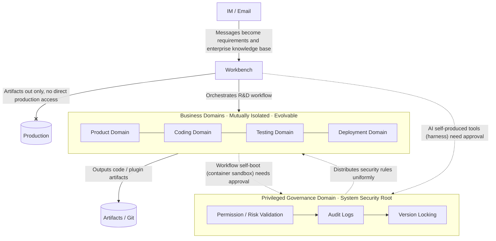

# DolphinMind

> **BaijiMind · 白鳍智章 (a.k.a. DolphinMind · 海豚智章) — Domain-Separated Controlled Self-Boot Agent Runtime**
> Domain-Separated Controlled Self-Boot Agent Architecture · Trust-domain isolation, privileged governance domain, plugin-based self-boot · MIT License

English | [中文](README.md)

⚠️ Note: this project is currently **v0.1**, for validating the Domain-Separated Controlled Self-Boot Agent Architecture. It has not been validated in large-scale production environments; assess the risk yourself before deploying. Evolution path: see [Roadmap](#-roadmap) below.

📌 Current status: concept & architecture-documentation stage, code implementation in progress — the repository's core is the [Architecture Whitepaper](docs/original-2026-paradigm-en.md) (English translation; the [Chinese original](docs/original-2026-paradigm.md) is authoritative).

## Introduction

This project takes the **Domain-Separated Controlled Self-Boot Agent Architecture** as its design goal; its core proposition: **how should production be organized so that humans and AI coordinate and play their distinct roles — supporting large-scale autonomous production and high-speed self-boot evolution, while remaining fully controllable and never spiraling out of control?**
The system uses trustworthy security domains as its basic model; the privileged governance domain is a special trusted domain in the domain system.
v0.1 adopts the minimal implementation of "privileged governance domain + several business domains"; the architecture itself **does not fix the number of domains**, supporting on-demand expansion and contraction.

Targeting enterprise R&D scenarios, it integrates with IM and email systems and orchestrates the complete R&D pipeline of product, frontend, backend, testing, and deployment into an executable workflow (orchestrable, self-organizing);
AI generates plugins/code artifacts; the workbench only outputs artifacts and is forbidden from directly operating production domains.

The whole architecture revolves around **controlled self-boot**: AI self-boots boldly, producing its own tools and workflows, but all self-boot output must pass approval-based promotion, versioning, and rollback; the governance anchor uniformly holds the rules and boundaries, with humans in the loop approving and defining boundaries.

## 📄 Documentation

- [Architecture Whitepaper (Chinese original)](docs/original-2026-paradigm.md) | the authoritative original whitepaper
- [Architecture Whitepaper (English)](docs/original-2026-paradigm-en.md) | full paradigm definition, product positioning, and dual-stack technical systems — IP archive document (translation)
- [v0.1 Implementation Plan (Chinese)](docs/v0.1-implementation-plan.md) | first-version implementation plan: key flows, module list, technical decision summary, implementation phases
- [v0.1 Architecture Decision Records / ADR (Chinese)](docs/v0.1-key-decisions.md) | first-version 16 key architecture decisions and risk checklist
- [Project Note (Chinese)](docs/about-note.md) | design inspiration, development notes, future plans
- [Project Note (English)](docs/about-note-en.md) | design inspiration, development notes, future plans

> As the project evolves, this section will be supplemented with security models, more architecture decision records (ADR), and other documents.

## 🧭 Architecture Overview

The core idea in one sentence: **how should production be organized so that humans and AI coordinate and play their distinct roles — supporting large-scale autonomous production and high-speed self-boot evolution, while remaining fully controllable and never spiraling out of control?**

Vision: **intelligence grows freely, order remains permanently controllable** — building a "controllably free" enterprise-grade agent runtime.

> How to read: the privileged governance domain uniformly validates security; business domains are mutually isolated and evolve independently; both coding-tool (harness) and workflow (container sandbox) self-boot need approval; the workbench only outputs artifacts and never touches production.

## ✨ Key Features

- Domain-separated security isolation model, with the privileged governance domain uniformly handling permission, version, and risk validation
- Integrates with IM / email bots; messages become requirements and knowledge base (**dual-path multi-platform IM capture**: a Koishi gateway for platforms with open APIs — Feishu / WeCom / DingTalk / QQ official; **desktop OCR capture** for platforms without APIs such as personal WeChat — employee-authorized, read-only, clipboard-assisted sending; unified `ImMessage` contract fed in over the message bus)
- Built-in lightweight visual workflow orchestration; configurable product, coding, testing, deployment stages
- Integrates multiple LLM coding capabilities; outputs plugin code, manually revised before committing to Git
- **Controlled self-boot**: AI-produced tools / workflows go through approval-based promotion, versioning, and rollback — freedom to evolve and governance control are two sides of one coin
- Humans in the loop: self-boot promotion / process advancement / rule revision / artifact merging all have approval gates; responsibility currently rests with humans, transferable as AI capability rises — attribution decided by cost and the capability function, computable
- **Goals and evaluation**: tasks/goals declare measurable completion conditions, paired with an independent evaluator separate from the executor — generator/evaluator separation; promotion only upon achievement
- Supports external knowledge bases, RAG, graph databases, and object storage
- Business domains can be added on demand; supports evolution toward distributed cluster scenarios

## 🛠 Technology Stack

> Single-Java modular monolith, cluster-deployable — see [Whitepaper §8 Engineering Landing](docs/original-2026-paradigm-en.md#8-engineering-landing-single-java-modular-monolith-wasm-sandbox)

- **Single-Java modular monolith**: Spring Boot 3.5 + Java 17 — one process carrying governance / business / execution / orchestration / RAG / IM, horizontally scalable as a cluster; modules decoupled via a **RocketMQ domain-event bus** (event-driven messaging, easy to split and compose)
- **Self-boot mechanism (code-as-institution)**: coding tools via **harness hot-plug**; AI-produced real code (Go) → **KVM test → Docker test → production** — runs in a **Docker container sandbox** after approval (resource caps / timeout / no credentials)
- Storage: OLTP, OLAP, document stores, Neo4j graph DB, MinIO object storage
- LLM cost/usage management: model routing, key pool, token accounting, cost reports — including decision-safety cost (verification/approval overhead for low-risk safe outward decisions; carries §3.1.4)
- Integration: IM / email systems, RAG, Git, LLM APIs, Penpot (open-source UI design)

## 🚧 Roadmap

- v0.1: validate the architecture; basic domain model, workflows, approval-based self-boot, IM bot integration
- v0.2: improve RAG, knowledge-base directory binding, template management
- v1.0: stability hardening, production-environment adaptation

## 📃 License

This project is under the MIT License — see [LICENSE](./LICENSE) file for details.
