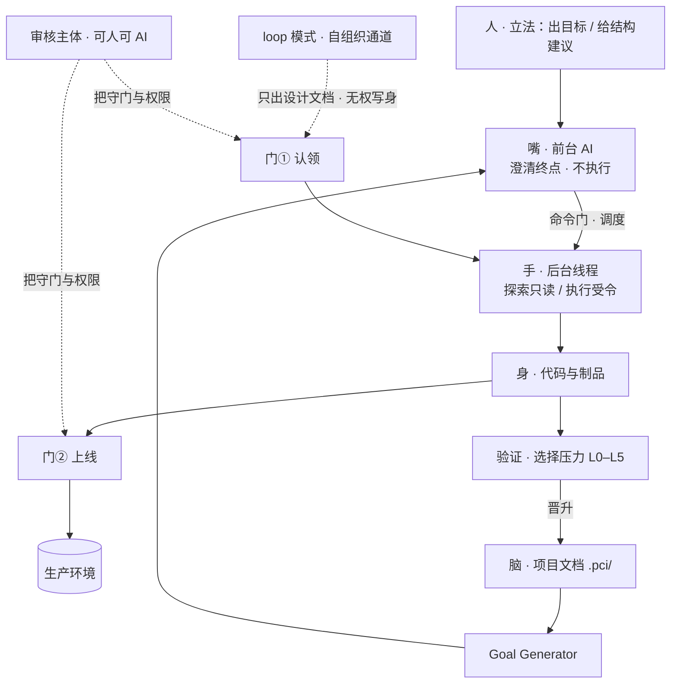
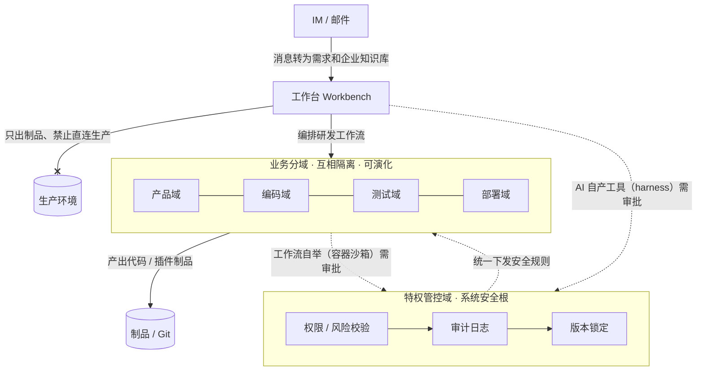

# DolphinMind · 海豚智章

> **项目中心智能运行时（Project-Centric Intelligence, PCI）** —— 让项目成为长期智能的主体，让 AI 模型成为可替换的智能引擎。
> 底座范式：分域受控自举智能体架构（BaijiMind · 白鳍智章）· 受控自举 · 全程可审计 · MIT License

中文 | [English](README-en.md)

⚠️ 提示：本项目目前为 **v0.1 阶段**，纲领与架构仍在演进，尚未经过大规模生产环境验证，上线使用请自行评估风险。实现路线见文末 [Roadmap](#-roadmap)。

📌 当前状态：概念与纲领阶段，代码实现推进中——仓库当前核心是[项目中心智能纲领](docs/project-centric-intelligence.md)。纲领写的是**思维框架与目标形态**，不等同于已实现的能力。

## 简介

长期智能的基本主体不是 AI Agent，而是 **Project**。项目持续拥有知识、状态、经验、策略与文档；LLM 只是可替换的引擎。通过「执行—反馈—经验—验证—策略—再执行」的闭环，项目不断积累智能、自组织生长，从完成单个任务，成长为能驱动公司的数字组织。

```text
Goal：目标 → 执行 → 完成 → 结束。
PCI： Project → Goal → Work → Feedback → Experience → Validation → Strategy → 新 Goal。
```

Goal 是项目当前要做的事；**Project 才是长期智能主体**。

## 🧭 核心命题

- **Project as Subject** —— 项目是长期主体。
- **Model as Engine** —— 模型是可替换引擎。
- **Project Continual Intelligence** —— 项目因过去而改变未来行为。
- **Experience Capitalization** —— 经验成为项目的数字资本。
- **Crystallization Ladder（结晶阶梯）** —— ReAct 探索 → Workflow 固化过程 → 域结晶：过程连同承载它的域一起固化。
- **Self-Evolution** —— 进化引导文件、工作流和元规则。
- **Documentation as Protocol** —— 文档是项目智能的接口。
- **Validation as Selection Pressure** —— 无验证，不入策略。

补充三条：

- **Subject as Legal Person（主体即法人）** —— 主体是权利与责任的承载者；人可以是主体，AI 也可以是主体。
- **Controller is Swappable（控制者可变）** —— 审核者不必是人；把独立的 AI 放到门后，仍是受控。
- **Body Self-Boots, Brain is Governed（身可自举，脑受控）** —— 产物可以自主生长；宪法、架构与约束必须走提案。

## 🗺 系统总览

核心思想一句话：**如何组织生产，才能让人与 AI 协调配合、各司其职，既支持大规模自主生产、高速自举进化，又全程可控、永不失控？**

愿景：**智能自由生长，秩序永久可控** —— 打造「可控自由」的企业级智能体运行时。



> 读图要点：**嘴**不下场执行，只把意图逼成可测的完成条件；**手**里探索线程只读、执行线程受令才开；**身**的产物要过两道门——loop 自组织通道无主体即无权限，只能提案（门① 认领），上线永远要过门②；**脑**（`.pci/`）只接收被验证筛选过的经验与策略，无验证不入。

## 主体论：主体即法人

这是全篇的基石。**主体 = 权利与责任的承载者**——借法人概念：能持有权利、承担责任的「人格」，不一定是自然人。

- **主体**：持有权限、承担责任。可以是**人**（自然人）、**AI**（一个持续的角色，而非某一次调用）、**群**（集体人格）、**任务**（如定时任务，自配权限）。
- **代理人**：不持有自己的权利，以某个主体的名义、借该主体的权限行动。**执行 AI 是代理人**——所以「AI 无独立权限」这句话只对代理人成立；主体本身是有权限的。

由此推得四条：

1. **主体 ≠ 模型。** 主体持续存在，引擎随时可换——审计记账在**主体**上，不在模型版本上。
2. **主体可委托。** 授权即边界，本质是委托关系。
3. **主体要登记。** 如同法人注册，每个主体一张簿：标识、类型、权限、**兜底人**。
4. **兜底人不可缺。** **AI 主体背后也必须挂一个兜底人**——责任的形式可以转移给 AI 主体，但兜底的链条不能断，追溯下去必须落到人。

**Project as Subject 里的那个 Subject，就是法人意义上的主体。**

## 人机分工：三权

- **立法（归人）** —— 定宪法、定结构约束、定验证标准。人的日常只有两件事：**出目标、给结构建议**。人不必逐次介入，但规则的最终修订权归人。
- **行政 / 事权（归 AI）** —— 干活与执行。AI 在这里全权：规划、执行、反思、积累经验、形成策略、改进工作流。
- **司法 / 审核（可人可 AI）** —— 审批与裁决。**可以外包给独立的 AI，乃至给它高权**——因为它被宪法约束、且全程可审计。
- **财政 / 人事（归管理层，AI 不介入）** —— AI 不碰这两项，只向高层给建议。在系统里它们退化为**权限边界**：AI 的权限集里根本没有「花钱」与「加人」，越界即拒。

一句话：**AI 全权行政，人握立法，司法独立且可交给 AI。**

**这是演进，不是开关。** 门后先坐人；等审核 AI 成熟、放权意愿到位，再换成独立于人的主体。

## 系统结构：嘴 · 手 · 脑 · 身

- **嘴 · 前台 AI** —— 与人对话、把意图翻译成动作、把状态翻译成人能懂的东西、调度后台。**它没有执行权，不下场。** 它最重要的一项职责是**澄清真正的终点**：人给的是字面要求，它能问，问到「真正要什么」再动手；模糊的命令因此被逼成**可测的完成条件**。
- **手 · 后台线程** —— 分两类：**探索线程**（只读，随时并行，去摸「现在是什么样」）与**执行线程**（写，受令才开）。
- **脑 · 项目文档** —— 项目的**意义层**：项目知道自己是谁、要什么、受什么约束。
- **身 · 代码与制品** —— 项目的**实现层**。约束与各类图，是脑与身之间的桥。

> 翻译不是独立的机制，它是「嘴」的沟通能力：读脑与状态，现场渲染成图。要分清**两类图**——`.pci/` 里维护的正式图（持久，属于脑）与对话里现场画的图（临时，画完即弃，不进脑）。

**概念组件**（框架的器官，非实现）：Project Core · Document System · Experience Store / Strategy Engine · Goal Generator · Model Router · Validation Engine · Self-Evolution Engine · ReAct Runtime / Workflow Runtime · Audit & Governance / Metrics Scorecard。

## 门槛：命令门与两道门

**命令门**：写，必须落在授权主体的权限边界内，且归属到一个主体明确表达的意图。对人是「下了令」；对定时任务是「任务定义本身就是它的意图」。

在此之上，生产流程有两道门：

- **门① 认领** —— 自组织通道（loop）的提案是**无主**的：没人发令，它就没有主体、没有权限。人（或审核主体）点头，等于**给它派了一个主体**，从此它才在权限边界内执行。这一道门堵死了「无人发令却能写」的口子——**loop 根本无权写身，只能提案**。
- **门② 上线** —— 制品进入生产，永远要过一道门。这是「生产只出不进」的落地。

```text
loop 路径： 自动找 goal → 出设计文档 ──[门① 认领]──→ 写代码 + 测试 ──[门② 上线]──→ 生产
命令路径： 人下令（门① 已过）──────────────────────→ 写代码 + 测试 ──[门② 上线]──→ 生产
```

**门后坐的不是「人」，而是「审核主体」。** 现在填人，将来填独立的审核 AI——**换坐位不改结构**。

**给高权的正确姿势是「按模式分级」，不是一刀切**：落入已知模式的自动批，不落模式的新东西上报给人。高权因此落在高频、低风险的大多数上，人只接住剩下的少数。

## 制衡两轴

分权不是两条并列原则，而是两个**正交的轴**：

- **横轴 · 职能分权** —— 人权、财权、事权不能握在同一主体手里。防的是**自己给自己扩权**：能干活 + 能加人 + 能花钱 = 无限膨胀。在本纲领的定位下（财政 / 人事归管理层），这一轴大多**退化为权限边界**：AI 的权限集里根本没有那两项。
- **纵轴 · 执行 / 检查分离** —— 干活的 ≠ 检查的。防的是**自己给自己打合格**：执行者不能自评「我做完了」，判定必须交给独立的评估者。

关键：**两轴都靠结构，不靠自觉。** 分权不能是「我们约定执行线程别去自评」，而必须是权限层面同一个身份根本拿不到两种权力——靠自觉的那叫倡议，不叫制衡。

若把审核交给 AI，它有三条硬约束：

1. **必须独立于提案者 / 执行者**——loop 提案，绝不能 loop 自批。
2. **权力天花板 = 它所代理主体的权限**——超出该主体权限的提案，它无权批，必须上人。
3. **不能碰立法**——否则它等于自己给自己放权，前两条被一键绕过。

## 结晶阶梯：ReAct → Workflow → 域

生产不止两种模式，而是一条**结晶阶梯**——解法从探索态逐级固化：

- **第一级 · ReAct** —— 探索态。灵活，文档引导，处理新问题；一次性解法，尚未固化。
- **第二级 · Workflow** —— 把**过程**固化下来：稳定、可复制、可规模化。它在既有的域里跑。
- **第三级 · Workflow + 域** —— 把**过程连同承载它的域一起固化**：长出一个新的**自治单元**——有自己的隔离边界、作用域与权限、局部原则和状态，能独立演化。

**为什么要有第三级**：有些解法不止是「一段流程」，而是「一个新单元」——它需要自己的隔离（故障不扩散）、自己的权限边界（只碰该碰的）、自己的局部原则。**固化出一个域，等于长出一个新的主体**；这正是项目从单项目长成组织的机制。

- **结晶**：ReAct 的成功解法 → 验证 → 固化（先固化为 Workflow，必要时再连同域一起固化）。
- **退化**：Workflow / 域失效 → 退回上一级 → 修复 → 重新结晶或废弃。

## 文档即协议

`.pci/` 是项目智能的接口，也是「脑」的载体——**多层次工程文档**：项目背景、目标、ADR、架构设计、代码约束、数据流程图、时序图……

```text
.pci/
  constitution/   宪法 · 元规则
  strategy/       结构 · 架构设计 · 约束
  org/            项目内的主体与角色
  knowledge/      项目背景 · 领域知识
  state/          当前状态
  goals/          目标（含待认领的提案）
  experience/     经验
  strategies/     策略
  models/         引擎路由
  audit/          审计
  metrics/        度量
```

文档不是附属记录，而是**协议**：主体之间、人与 AI 之间，都通过它交互。

## 验证即选择压力

无验证，不入策略。证据分级：

- **L0** 日志
- **L1** 单元测试
- **L2** CI / 集成测试
- **L3** 人工 review
- **L4** 线上指标
- **L5** A/B、因果推断、回溯测试

**选择压力的来源可以更换**：可以是人的审批，可以是证据本身，也可以是一个独立的审核主体。等级越高越接近「可自动放行」，越低越需要外部判断——这正是「控制者可变」的落点。

## 生长路线

- 0 单任务
- 1 单 repo 自维护
- 2 项目自组织
- 3 多项目迁移
- 4 组织化
- 5 公司 OS

向上的关键动作，常常是**域结晶**——长出新的主体（见[结晶阶梯](#结晶阶梯react--workflow--域)）。这是 PCI 的**能力成熟度阶梯**，与下方 [Roadmap](#-roadmap) 的交付版本计划不同。

## 🔗 与分域受控自举架构的关系

PCI 与[《分域受控自举智能体架构》](docs/original-2026-paradigm.md)是同一套内核的两种形态——都在做**变异—选择—保留**：

- 范式：**审批驱动**，控制者是人。
- PCI：**验证驱动**，控制者是证据 / 独立审核主体。

区别只在**选择压力由谁给**。因此两篇并不冲突，而是**自治度谱系上的两点**：范式偏收敛（人把关），PCI 偏高自治（AI 自举、证据筛选、审核主体坐门）。



范式侧的要点，在 PCI 里各有对应机制：

- **分域安全隔离模型**：特权管控域统一做权限、版本、风险校验，业务分域互相隔离、可独立演化
- **受控自举**：AI 自产工具 / 工作流经审批晋升、版本化、可回滚——自由进化与治理受控一体两面
- **人在环中**：自举晋升 / 流程推进 / 规则修订 / 制品合并均有审批把关；责任当前归于人，随 AI 能力提升可转移——责任归属由成本与能力函数判定、可计算
- **生成 / 评估分离**：任务与目标声明可测完成条件，配与执行者分离的独立评估者判定达成——达成才晋升

| 分域受控自举 | PCI |
| --- | --- |
| 分域 | **主体** |
| 域可增删、独立演化 | **域结晶（长出新的主体）** |
| 授权即边界 | **权限边界 / 委托** |
| 独立评估者 | **执行 / 检查 分离** |
| 制品强隔离（只出不进） | **门② 上线** |
| 集权审批（人把关） | **审核主体（可人可 AI）** |

## 🛠 技术栈

> PCI 纲领只写思维框架、不涉及实现；下表是**底座范式的落地形态**，完整设计见[范式白皮书](docs/original-2026-paradigm.md)。

- **单 Java 模块化单体**：Spring Boot 3.5 + Java 17，一个进程承载治理 / 业务 / 执行 / 编排 / RAG / IM 全部能力，可集群横向扩容；模块间以 **RocketMQ 领域事件总线**解耦
- **自举机制（代码制度）**：编码工具经 **harness 热插拔**；AI 产真实代码（Go）→ 先 KVM 测试、再 Docker 测试、最后上生产——审批后 **Docker 容器沙箱**运行（资源上限 / 超时 / 无凭据）
- **IM 采集双路径**：Koishi 网关接飞书 / 企微 / 钉钉 / QQ 官方等有开放接口的平台；**桌面 OCR 采集**接个人微信等无接口平台（员工授权、只读采集、剪贴板辅助发送）；统一 `ImMessage` 契约经消息总线汇入
- **存储**：OLTP、OLAP、文档库、Neo4j 图库、MinIO 对象存储
- **LLM 成本 / 用量管理**：模型路由、key 池、token 统计、成本报表——含决策安全成本
- **集成**：IM / 邮件系统、RAG、Git、大模型 API、Penpot（开源 UI 设计）

## 📄 文档

- [项目中心智能纲领（PCI）](docs/project-centric-intelligence.md) —— 思维框架：主体论、三权、结晶阶梯、文档协议、生长路线
- [分域受控自举智能体架构 · 原创范式白皮书（2026）](docs/original-2026-paradigm.md) —— 底座范式的完整定义、产品定位与技术体系

## 🚧 Roadmap

- v0.1：验证架构，基础域模型、工作流、审批式自举、IM 机器人对接
- v0.2：完善 RAG、知识库目录绑定、模板管理
- v1.0：稳定性加固，生产环境适配

## 📃 License

This project is under the MIT License - see [LICENSE](./LICENSE) file for details.
