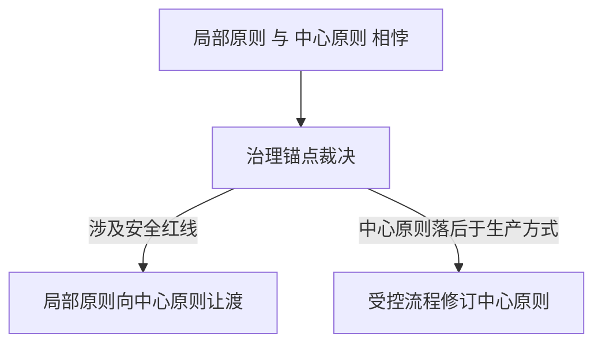
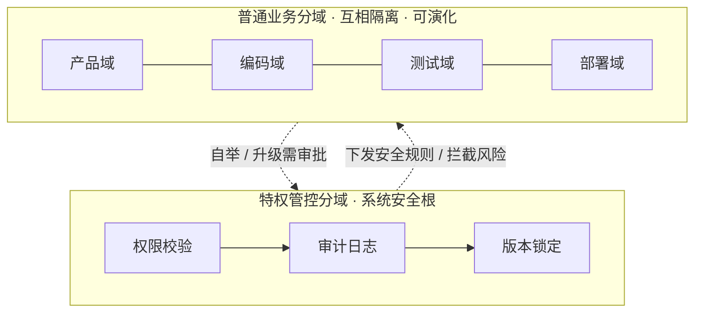
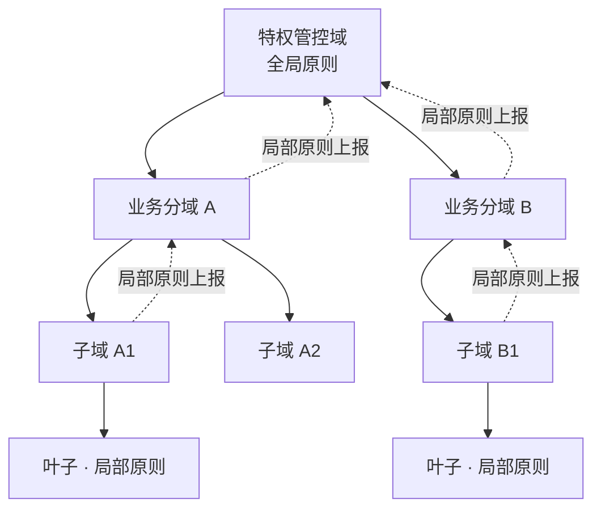
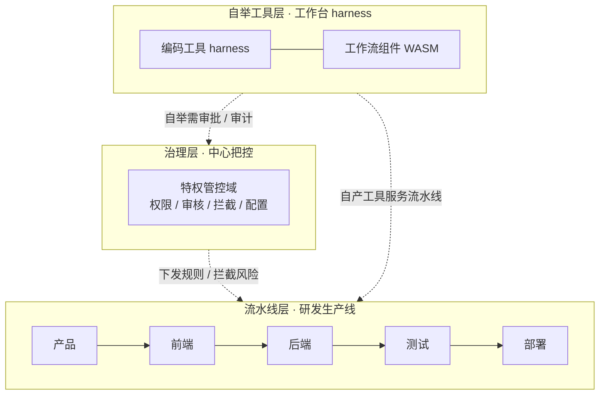
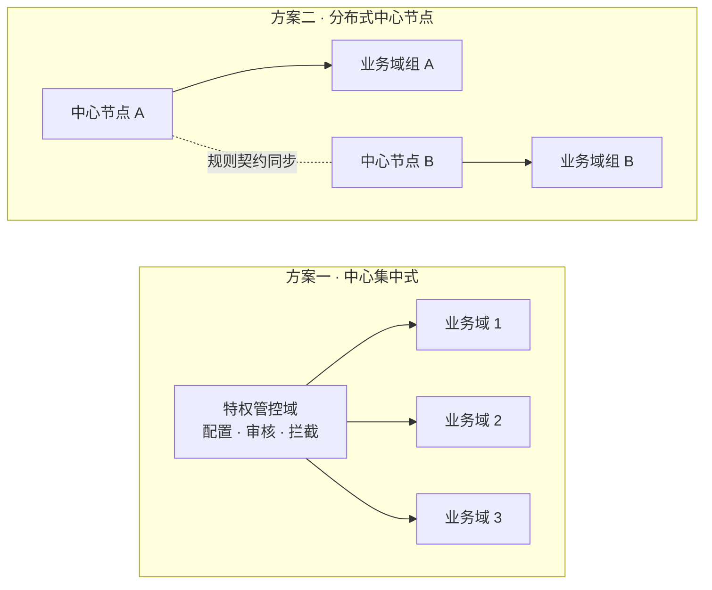
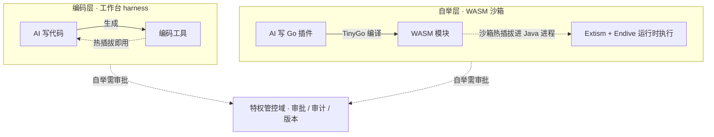

# 分域受控自举智能体架构 · 原创范式白皮书（2026）

> 作者：CanWeakerWriteStrongCode

## 1. 文档说明与版本说明

本文档是2026年由作者独立构思的智能体架构设计范式，也是分域受控自举智能体架构的官方设计文档。

文档固定了这套架构的底层规则、域划分标准、安全约束和扩展逻辑。后续所有代码开发、版本迭代、功能拓展、场景落地，都要遵循这套核心定义，不会推翻底层架构。

需要说明的是：本文档描述的是本范式的**完整设计目标**与底层规则，不等同于当前代码已实现的能力；实现进度与版本计划见项目 README。

文档版本：v0.1 最终定稿（范式锁定）

文档日期：2026-08-21

对应开源项目：domain-separated-self-boot-agent-runtime

## 2. 架构正式名称与定位

- 产品代号：BaijiMind（白鳍智章）
- 别称：DolphinMind（海豚智章）
- 中文名称：分域受控自举智能体架构
- 英文名称：Domain-Separated Controlled Self-Boot Agent Architecture

核心定位：专门适配企业研发、自动化办公、智能生产场景的AI智能体架构，核心特点是「AI可以自我升级，但全程可控、安全不失控」。其普遍思想内核见 §3。

## 3. 思想内核：一种通用的自主生产组织范式

“分域受控自举”不只是一种软件架构，更是一套**通用的系统组织思想**。它要回答的问题是：**如何组织生产，才能让人与 AI 协调配合、各司其职，既支持大规模自主生产、高速自举进化，又全程可控？**

### 3.1 两个前提：AI 与人同为生产主体与认知主体

在未来的生产方式中，AI 与人**同为生产主体、同为认知主体**——都参与思考与决策，都在生产中起作用，分工不同而非高下不同：

- **AI 的主体性在生产与进化**：承担大规模、高并发的产出与自举——自组织流水线、自我生产工具，主导生产方式在治理边界内的演进（AI 只做提案、不做重大决策，见 §3.2.4）
- **人的主体性在目标与责任**：设定生产目标、把守规则红线，在统筹全局下对 AI 产出快速判断出低风险方案并终审，承担当前阶段的责任（随 AI 能力提升可转移，见 §3.1.2）

二者还有一处根本的速度不对称：**AI 的迭代速率远超人类**，且随着自举能力走向成熟，这一差距在未来很可能进一步拉大。AI 的自举可以在极短时间内完成一轮自我改进——生成工具、改造流程、甚至修订局部原则；而人类制度与观念的更新以年计。这正是“受控自举”存在的原因：进化的速度越快，越需要治理锚点把住方向——否则高速自举就是高速失控。

### 3.1.1 治理重心的分野

**AI 与人在组织中的异同，决定了治理重心的分野**。相同的是：二者同为生产主体与认知主体，共同在组织框架内起作用。不同的是三处，各自指向不同的治理重点：

- **诚实与失真**：AI 无私欲、会如实上报——没有利益集团、报喜不报忧、寻租，汇报可全量数据化审计；但它有**注意力机制的问题**：上下文窗口有限会遗漏长程信息与早先约束、信息不足会幻觉、优化目标会偏离意图（规格博弈）——这是**无意图的失真**。更根本的是，AI **无法可靠地靠内省自我修正**——纯内省缺乏客观锚点，常把对的改成错的、或原地打转；其自我改进本质上是**反馈驱动**的：靠边界报告、测试驱动、工具自省等外部反馈发现缺点，而非靠"再想想"。故 AI 治理不必防「撒谎」，但要防「注意力失真」，靠 §3.2.3 的边界报告与测试驱动把行为编码为可验证断言；人有权衡与利益、汇报会失真——**有意的失真**，要靠分权与交叉验证对冲。
- **速度与控制**：AI 迭代毫秒级、发展过快——治理重点是**控制**：如何把住流程与全局结构、约束高速自举，防高速即失控；人变更以年计——治理重点是**变革**：如何克服制度惰性、追平生产方式。故对 AI，核心矛盾在「控」；对人，核心矛盾在「变」。
- **责任**：责任归属是能力的函数，随 AI 能力提升可转移，由「谁能以更低代价扛住后果」决定分工（完整论证见 §3.1.2）。

一句话：**AI 快且无私欲，风险在失控，治理重「控」；人慢但能负责，风险在惰性，治理重「责」与「变」。二者在同一组织框架内互补——AI 的快由治理锚点控制，人的慢由 AI 的自举补足。**（组织层面的详细差异见 §9）

### 3.1.2 责任：能力的函数，人机协同

**责任有锚点**：治理锚点与中心原则的最终修订权，归于人（或人设计的受控流程）——这正对应 §3.2 的辩证关系。但**责任是能力的函数，不是神圣的固定锚点**：以当下的价值观为基准，人仍是责任主体，可这一归属随 AI 能力提升而可转移——AI 足够聪明、足以承担后果时，把责任交给 AI 同样成立（现实中 AI 写代码直接上线测试、人只粗看抽象层与代码结构，已是常态）。

**当前阶段人承担的具体责任，从生产力视角看是「统筹全局下快速判断出低风险方案」**：复杂场景下短时间无法为 AI 设定好工程上的输入输出，此时依靠人快速审核与判定——人擅长**在统筹全局的情况下，快速判断出低风险的路径**：人的判断不是脱离全局的廉价捷径，而是始终握着全局、基于全局上下文的即时裁决，代价低；AI 若做同样的事须临时重新统筹全局，思考量巨大、不经济（形式化见 §3.1.4）。

**人机协同的最终形态是在任意维度上都可协同**：人在每个 AI 不经济的环节以低成本补位，AI 在每个需要巨量思考的环节全力产出。

### 3.1.3 AI 的局限与工程对策

AI 作为认知与生产主体，其已知局限及对应工程对策如下——多数可工程化解决，少数触及能力的结构性边界，解决之道是治理与人机分工：

| AI 局限 | 表现 | 工程对策 |
| --- | --- | --- |
| 注意力失真 | 上下文有限漏长程/早先约束、幻觉、规格博弈 | 边界报告 + 测试驱动 + 独立评估，把行为编码为可验证断言（§3.2.3） |
| 无法内省自我修正 | 纯内省无客观锚点，常对改错或原地打转 | 外部反馈回路：工作中暴露 + 验证（§3.1.1 诚实与失真） |
| 无信念软约束内化 | RLHF / DPO / 宪法式 AI 只是模拟行为倾向 | 硬制度 + 全局延迟反馈闭环 + 集权审批（§3.2.4） |
| 不能自验与调试 | 缺交互式定位问题的工具 | 编译运行测试 + 仿真 + 交互式 debug 工具（工程可补） |
| 抽象层与实现层同步难 | 深入细节时稀释全局视图 | 多轮外部 I/O 重组 + 记忆分层 + 外部草稿区（scratchpad）（工程可补） |
| 新抽象无标准答案 | 新抽象的长期价值当场无法判定 | 多层评估 + 低风险冒险：小范围试点、可回滚、边观察边修正 |
| 全局统筹思考量巨大 | 全局调度计算代价高、不经济 | 人承担统筹全局下快速判断出低风险方案（见 §3.1.2 责任） |

一句话：**工程解决"机械性缺失"，治理解决"无标准答案的判断"，人机分工解决"巨量思考的经济性"**——三层各司其职，构成人机全面协同的完整拼图。

### 3.1.4 能力边界与使用成本

上述局限可归结为两个入参模型：

#### 能力边界

AI 的能力边界由三个入参决定——模型规模 P（参数量：决定能力天花板，收益递减）、后训练思维链水平 T（决定把天花板发挥出几分）、上下文长度 M（即记忆能力：决定单次任务能握住的全局信息上限）：

C = F(P, T, M) ≈ P^α · η(T) · κ(M)，其中 α∈(0,1)，η、κ∈(0,1]

两个性质：**短板效应**——能力受最弱一环钳制，P/T 再强、M 小则大问题装不下；**边际递减**——任一入参拉到极限收益递减。

#### 使用成本

使用 AI 的真实成本分两笔——名义前向成本 W（随 P 近线性、随 M 超线性 O(M²) 增长——O(M²) 是全注意力基线，工程手段如稀疏注意力（NSA）、KV 缓存压缩（MLA）可大幅降低其斜率，但难彻底消除超线性）与**记忆补偿成本** D。其中 **S = 任务所需工作记忆**，即完成该任务必须同时握住的全局信息量（跨多轮、多环节的累计）；当 M 不足以承载 S 时，需以外部工程手段——记忆同步、上下文重放、多轮重组、检索——补齐缺口，由此产生额外电力与时间，即 D：

Cost = W(P, M) + D(M, S)，其中 D ≈ max(0, S − M)^γ · c（γ > 1；c 为单位补偿成本；M ≥ S 时 D ≈ 0）

补偿并非随缺口线性增长——缺口越大，需检索与重组的片段越多，片段间的交叉一致性与多轮重放使成本**超线性**上升，故取 γ > 1。

**决策安全成本**。成本不限于电力与时间——AI 的决策作用于外部世界，还必须对外低风险、安全（如生产场景须保护机器与人身安全）：决策前经边界报告、测试与人在统筹全局下快速判断出低风险方案，决策后固化版本可回滚。这些验证、审批与兜底的开销，是电力与时间之外的**决策安全成本**，由治理机制承担（见 §3.1.2 / §3.2.3）。

#### M 的双刃剑与经济最优

上下文长度 M 同时出现在两个公式且方向相反：M 增大提升能力边界，同时减少记忆补偿、却让前向成本超线性上升——故存在一个经济最优的记忆长度，是能力收益与记忆成本平衡之点。这也为「人擅长在统筹全局下快速判断、AI 做同样的事不经济」提供了公式化注脚：**人的"统筹全局"记忆是内置的、零补偿**（长期记忆与层级抽象天然免费），AI 的全局须临时重建、每次付补偿成本——经济性差异由此而来。

### 3.1.5 决策归属：正确率、风险与总期望成本

§3.1.2 论证了责任是能力的函数——能力之差决定「谁能以更低代价扛住后果」。但「负责」的另一半是**正确率**：决策交给谁，不只看谁扛得住后果，更看谁的**总期望成本**最低。一次决策的总期望成本 = 决策成本 + 意外期望损失：

E[Cost_X] = D(X) + (1 − p_X) · L

其中 **D(X)** = 决策成本（电力与时间 + 决策安全成本，§3.1.4），**p** = 正确率，**L** = 事故代价（后果由谁扛、扛多疼）。(1 − p) · L 即**意外期望损失**——正确率足够高时，它被**定价**而非被绝对禁止。

**正确率是能力余量的函数**。设 R = 决策所需算力，则：

p = g(C / R)，C ≫ R 时 p → 天花板（≈ 1）

当 AI 的能力边界远大于一次决策所需的算力（C ≫ R），短板效应不生效、正确率逼近天花板、意外期望损失趋近于零——此时把决策交给 AI 是经济最优：人用「接受小概率意外」换「委托出去的经济性」。现实中 AI 写代码直接上线测试、人只粗看抽象层与代码结构，正是正确率足够高之后，人愿意把残余风险买下来。

**两端一夹，统一了决策归属**：R 小、能力余量大的决策，AI 便宜且高正确率，归 AI；R 巨大、须统筹全局的决策，人靠内置记忆零补偿、AI 须临时重建全局并每次付补偿成本（§3.1.4 M 的双刃剑），归人。归属由总期望成本最小化决定，而非「机器该不该做决定」的先验立场。

**§3.1.4 决策安全成本的本质由此补全**：它就是**花钱买 p、压 L**——边界报告、测试、审批与回滚把正确率推上天花板、把事故代价压到可接受，使「委托出去」成为经济可行的选项。

**意外不可避免，补救要经济**。正确率 p 对任何主体都到不了 1——人和 AI 都会发生意外。因此关键不只在把 p 推上天花板，更在把意外的补救成本压低：把事故代价拆为 L = L₀·ρ，其中 **L₀** = 意外造成的原始损失、**ρ** = 补救系数（同一意外，补救手段越经济 ρ 越小），则 E = D + (1 − p)·L₀·ρ。**p 有天花板，ρ 可被工程持续压低**——**重放日志**是压 ρ 的关键：让意外低成本地定位出错点、回滚到安全版本、审计复盘，把不可逆损失变成可逆的流程成本。重放日志一身两用：既压 ρ（意外补救），又补 §3.1.4 记忆补偿 D（上下文重放）。治理锚点的审计、版本锁定、可回滚由此获得第二重意义：**受控与放权同构——补救越经济，委托越可接受**。

### 3.2 一个辩证内核：生产力与生产关系

AI 的自举——自我生产工具、自组织流程——是系统进化的**生产力**；治理层（中心原则）是约束生产力运行方式的**生产关系**。二者构成辩证关系：

- **生产力推动生产关系**：新的生产方式不断涌现，会持续推动中心原则的修订——治理规则必须随生产方式演化，不能僵化
- **生产关系指引并约束生产力**：中心原则约束 AI 的自举、防止失控，同时**指引生产的方向**——划定边界与优先级，把自主进化导向既定目标
- **中心原则的修订本身受控**：由人类或受控流程发起，而非任由 AI 无约束地自我修改——这正是“受控自举”中“受控”二字的含义

一句话抽象：**“单元自治进化，治理锚定可控。”**——即愿景中的：**智能自由生长，秩序永久可控。**

自举与治理的交替否定，推动系统**螺旋式上升**：自举倒逼治理升级，治理又为更大胆的自举松绑——二者互为阶梯，而非静止的平衡。

### 3.2.1 转化的机制：双环咬合的 PDCA 循环

生产力向生产关系的转化，不是抽象的"新的生产方式不断涌现"就自动发生。**生产力有自己的 PDCA 环，生产关系也有自己的 PDCA 环，两环咬合传动**——生产关系的升级不会自动跟着生产力走，而是被生产力升级"打破旧均衡"后，由生产关系自己的环追平。

**生产力环（工具/生产方式的自我进化）**：

- **D** 用工具干活（agent 真实任务中调用 harness）
- **C** 工具自省（机械信号 + 使用小结：重试、别扭、低效）
- **P** 新工具/新生产方式提案（新插件、工具新版本）
- **A** 审批晋升（沙箱即写即执行 → 版本 ACTIVE → 注册生效）

产物：**新生产力**。此环机制最完整（工具自省、沙箱晋升、注册中心，见 §3.3 实例）。

**生产关系环（治理/流程/规则的自我进化）**：

- **D** 组织按现行规则、流程、审批门运转
- **C** 观察器周期审视 + 越权审计 + 流程检查——不只检查"活干得怎么样"，更检查"**规则本身是否还适配现在的生产方式**"：有无卡点、僵化、错位的审批门、落后的权限边界
- **P** 生产关系修订提案：新流程定义、新审批门、补授权/收紧规则、修订中心原则、乃至新的域划分与治理形态（§7）
- **A** 治理锚点审批修订发布（修订权归于人/受控流程，见 §3.1），验证后固化为中心原则，无效则回滚

产物：**新生产关系**。

**咬合传动——"生产力升级，生产关系怎么跟着升级"的机制**：

- **被动传动（摩擦驱动）**：生产力环每转一圈，其落地（A 的新工具/新生产方式）必然突破或触碰生产关系旧边界——越权被拒、审批卡点、流程不匹配、规则落后。这些**摩擦信号**全部进入生产关系环的 C（审计/观察器），带动生产关系环修订追平。所以"生产力推动生产关系"不是口号，而是生产力的落地在物理上撞击旧规则边界、产生可观测的摩擦、触发修订。
- **主动传动（审视驱动）**：生产关系环自身也主动转——观察器周期审视规则/流程本身，不等生产力来撞，主动发现"这条规则已经该改了"。

两环咬合的净效果即 §3.2 的**螺旋式上升**：生产力环 A（新工具落地）→ 生产关系环 C（感知滞后/摩擦）→ P/A（修订：松绑或设界）→ 生产力环下一轮 D 在新边界内更大胆地转。

**治理锚点**就是生产关系环 A 中"标准化"的执行者：把验证过的经验固化为规则，把不适配的回滚——"受控"贯穿两环，不让任何一环失控。

实例：

- **生产力环**：AI 用 harness 写发布说明到第 3 次，C（工具自省）发现"每次都手工整理变更清单" → P 提议"发布说明生成"插件 → A 审批注册、从此自动生成。生产力环转一圈。
- **生产关系环**：C（观察器）发现"UI 评审总卡在同一节点等人工" → P 提议调整流程节点/新增评审自动化 → A 审批后新流程生效 → 验证。又或 C（越权审计）发现"某类操作频繁被拒" → P 提出补授权或收紧规则 → A 修订中心原则。生产关系环转一圈。

**一句话：生产力升级 ≠ 生产关系自动升级；生产关系的"跟着"靠的是它自己的环——被生产力落地撞出的摩擦信号（被动）与对规则本身的主动审视（主动），经 C→P→A 修订追平。两个环各自受控、咬合传动，组织才螺旋式上升。**

### 3.2.2 思想的支撑：与既有思想的衔接

双环咬合不是孤立发明——它与四支成熟思想同构，且每一支都能在系统机制上找到落点。

**① 双环学习（Argyris & Schön）——为什么有两个环**

组织学习理论区分两种改进：**单环学习**在现有规则内把事做好，**双环学习**质疑并修改规则本身。本范式的两环恰是这两种学习：

- **单环（生产力环）**：agent 第 3 次写发布说明 → 工具自省把"每次都手工整理变更清单"的信号写入工具调用反馈 → 提议"发布说明生成"插件 → 提交审批 → 通过后注册进插件能力中心、热插拔生效 → 下次自动生成。**规则（发布流程）没变，在规则内变聪明**。
- **双环（生产关系环）**：观察器周期审计发现"发布确认节点每次都等人 2 天、卡点指标异常" → 提议修订流程定义（去掉或替换该节点）→ 治理锚点审批 → 流程新版本生效 → **规则本身被改**。

**② 必要多样性定律（Ashby）——为什么治理必须跟着生产力演化**

控制论定律：控制器的多样性必须 ≥ 被控系统的多样性，否则失控。本系统中被控对象是日益多样的生产方式：

- AI 自举使能力标识持续增多（从内置几个到自举几十个），调用场景、越权模式同步增多。
- 若中心原则只是固定静态规则，新能力、新越权一旦超出规则覆盖 → 默认放行或默认拒绝 → 失控。
- 应对即"治理可演化"：审批新能力时同步补规则（审批与规则修订联动）、越权审计发现"某类操作频繁被拒"→ 补授权或收紧规则、中心原则本身可版本化（与插件版本同构）。**治理手段必须跟上生产方式的花样**。

**③ 耗散结构 / 负熵（Prigogine）——为什么需要治理锚点**

热力学视角下，开放系统靠持续引入负熵维持有序；远离平衡态产生自组织。本系统两面都是这个规律：

- **自举 = 远离平衡态的自组织**：AI 每产出一个插件/新流程，系统能力维度 +1，结构越来越复杂有序。
- **熵增趋势**：插件版本增多、事件膨胀、越权尝试增多、规则散落——若无治理，内部走向配置漂移、权限散乱、流程失控。
- **治理锚点 = 负熵注入**：插件运行时注册表与控制面版本对账防漂移、审计日志全量记录防越权蔓延、审批+版本+回滚防自举乱改、分布式锁防定时任务重复执行——每一个机制都是一次"注入秩序"，把系统从混乱边缘拉回有序。**"智能自由生长，秩序永久可控"本质是在对抗熵增**。

**④ 定向进化（变异—选择—保留）——为什么每步自举都要审批**

进化 = 变异 + 选择 + 保留；本系统的自举是同一套的人工化、定向化版本：

- **变异**：agent 用插件提议工具生成插件草案 → 草案进入待审状态。
- **选择（审批 = 人工化的自然选择）**：草案在沙箱开发态试运行（小范围检验）→ 提交审批 → 人/治理锚点通过（保留）或驳回（淘汰）。
- **保留**：通过后置为正式版本、注册进插件运行时 → 能力标识进入发现路由，被后续任务调用，成为组织"基因"；回滚即清除不适应环境的基因。
- 与自然进化之差：变异有目的（AI 智能，而非随机突变）、选择有方向（治理锚点朝既定目标，而非盲目环境压力）——故为**定向进化**。

一句话：双环学习回答"为何两环"，必要多样性回答"为何治理必须演化"，耗散结构回答"为何需要治理锚点"，定向进化回答"为何每步要审批"——四支思想共同印证：**这套组织规律不是发明，而是对成熟规律的机制化落地**。

### 3.2.3 效率的杠杆：多管齐下——让审批追得上自举

**两难**：速度不对称带来一个治理两难：AI 自举毫秒级迭代（见 §3.1），而人作为检查师与最终审批者，若逐行审查 AI 产物——审得细，就成了进化的瓶颈（审批积压、流程僵化）；审得快，就成了橡皮图章（受控名存实亡）。两难的本质是：**人的注意力跟不上 AI 的产出量**。

**解法：多管齐下，而非单一机制**。让审批追得上自举，不是某一个招法能单独解决，而是一组机制协同作用——**模式化分流**让常规审核变快，**双层面审核**保证局部与全局都不漏，**边界报告 + 测试驱动**让安全可验证、选择有依据，**模式库**让审核效率复利式提升，**专家团**把守模式外的例外。以下逐一展开。

**第一管：模式化——让常规审核变快**。杠杆是**把重复固化为标准，把注意力留给例外**，复用软件工程两条成熟思想：

- **约定大于配置（Spring Boot）**：把默认行为固化为约定，只有例外才显式配置——审核同理，多数产物落入约定，人只审例外
- **设计模式（GoF）**：把反复出现的解法固化为模式，识别模式即理解行为——审核同理，识别产物模式即理解其行为，无需逐行阅读

这一杠杆不是为审核而造，而是生产早已验证的成熟做法：组件库、脚手架、低代码编排、数据库表设计里的**拉链表**（历史全量留痕）与**闭包表**（树结构关系存储），无一不是「把重复固化为标准」的落地。审核只是把这套效率杠杆复用到 AI 产物的把关上——**按模式分流**：

- **模式内产物（约 80-90%）**：AI 自举产生的插件、工作流、配置变更，绝大多数是已知模块的组合、落入既定约定模板。审核变成**模式内校验**——对照模式模板 + AI 辅助预检（自动测试 / 静态校验 / 边界检查）+ 人做模式级确认，即可快速放行。
- **模式外产物（约 10-20%）**：真正创新、不落入任何已知模式的产物，进入**专研通道（专家团）**——由专家团队深度审查，必要时设计新模式。

**第二管：双层面审核——局部与全局都不漏**。不能只对着单个产物：

- **组件级审核（局部模式与约定）**：每个组件有自己专属的模式和约定——插件按插件类型模板、工作流按阶段模板、工具按调用契约。审单个产物是否落入它应属的模式、是否符合该组件的约定（模式内快验 / 模式外专研）。
- **组织级审核（组织结构与组织路径）**：产物不是孤立的，它要嵌入整体组织结构——归属哪个域、经哪些组织路径（流程编排、跨域流转、数据流向）、触碰哪些域间边界。审的是产物对组织结构的改动是否越界、是否符合中心原则、是否扰动其他域——对应 §3.3 局部原则与中心原则：**组件级审局部，组织级审全局**。

**第三管：边界报告 + 测试驱动——安全可验证、选择有依据**。模式级确认只是审核的一部分，人还要定边界、把测试：

- **边界界定**：AI 生成**「边界报告」**——总结产物的行为边界：哪些行为落在既定模式与权限范围内、哪些擦边、哪些越出既有边界、牵涉哪些安全红线。人依据边界报告判定「这条边界该划在哪、要不要移动」，研究边界外的新情况应否固化为新模式、或收紧/放宽既有边界——**安全红线的最终判定始终归人**（见 §3.1）。
- **测试把关**：测试驱动让边界可验证——**AI 自举产物以测试为先**：生成插件 / 工作流时先产出测试，用测试定义期望行为与边界，跑通测试才可晋升（给 §3.3 定向进化的「选择」以客观依据）；测试是边界与红线的**可执行表达**——边界报告描述边界，测试把边界编码为断言。模式内产物靠模式模板的回归测试快验，边界外新情况靠新测试界定行为——人审的是测试覆盖是否守住了边界，而非逐行实现。

**第四管：模式库——审核效率的复利**。模式不是死的清单，而是一个随生产方式演化的活库：AI 产物不落已知模式 → 即「新模式提案」→ 人深度审 → 固化进模式库（模式库本身版本化、可审批）；新模式固化后，后续同类产物全部快速审——审核效率随之提升，反过来支持更大胆的自举。这构成正反馈闭环，是 §3.2 螺旋式上升在审核效率上的落地：**自举 → 模式识别 → 模式库演化 → 审核提速 → 更大胆的自举**。新模式固化要经审批，正是「中心原则修订受控」的体现——模式库是生产关系随生产力演化的一个具体载体。

**延伸：这套机制同样指导人类组织自身的改造**。人类组织面对不断变化的组织形态，一直在朝「用标准处理常规、用专家应对例外」演进，制度里已有现实原型：

- **审批制 → 备案制 / 告知承诺制**：行政审批改革的主线，正是「模式分流」的制度版——常规事项改备案、按标准快速通过（模式内快放），高风险事项保留审批、走论证（模式外专研）
- **中枢审批机构**：承担治理锚点——项目立项审批（审批门）、政策制定（中心原则）、规划引导（指引生产方向），是「受控自举」在国民经济层面的投影
- **专家团 / 评审委员会**（可研、环评、技术评审）：承担专研通道与边界把关——模式外、高风险、创新性的项目，由专家深度论证后放行

因此人类组织自我改造的方向清晰：**设模式库**（把经验固化为标准）、**配专家团**（把守边界）、**立中枢锚点**（统一规则与审批）、**行边界审计**（持续审视）——AI 时代把同一套机制数据化、自动化，组织即用标准处理常规、用专家应对例外，追得上自举的速度。

人由此从「审每一行」解放为「审模式、定边界」：模式化让常规审核变快，双层面审核不遗漏整体，边界报告 + 测试驱动让安全可验证，模式库让效率复利——**多管齐下，才追得上自举的速度**，既避开逐行瓶颈，也避开橡皮图章。

### 3.2.4 AI 只做提案：以集权审批规避对齐风险

**理论原点：AI 系统的"组织失灵"与人同构，但根源不同**。人类大组织的痛点是委托—代理、寻租、部门本位——根源是人有私利，表现为组织政治；多 AI 单元系统会出现等价失灵（目标错配、spec-gaming 规格博弈），但 AI 无私欲，根源是**目标规格写不完备**——组织政治被对齐问题替代。可复用组织经济学的分析框架，把"人的私利"替换成"规格不完备错配"（对应 §3.1 的「无意图失真」）。

**人类的两套治理手段，AI 不能简单照搬**：

- **硬制度**（审计、分权、预算、审批）：AI 侧可以工程实现（哨兵审计 Agent、沙箱、配额、熔断），大厂已落地；但只能处理**可检测**的漏洞
- **软约束**（价值观、信念、文化内化）：人可以真正内心认同；宪法式 AI 等方向有望让 AI 逐步内化原则，但**当前尚不成熟**——RLHF / DPO / 宪法式 AI 目前只是**模拟行为倾向**，属辅助防线，**强优化压力下会被击穿，不能用来兜底灰色地带**。架构视角：**中心原则即 AI 的"宪法"**——若宪法式 AI 成熟，AI 可在自动化预审环节依据中心原则自检、源头拦截越界产出，但兜底仍归治理锚点与审批。
- 人类靠信念填补制度缝隙；AI 既无信念内化、也不能靠内省自我修正（见 §3.1），只能靠**全局延迟反馈闭环**做补偿（推荐系统已落地；通用多 Agent 还有归因、延迟等工程难点，见 §3.2.3 测试驱动）

**核心方案：AI 只做提案，不做重大决策**。AI 负责把业务需求生成插件 / 微服务代码、配置，**没有业务执行权限**；低风险常规决策可分级自动放行，**重大决策归人**——不仅因 AI 尚难为重大判断承担后果（见 §3.1.2），也因成本：人擅长在统筹全局下快速判断出低风险方案、代价低，AI 做同样的事须临时统筹全局、思考量巨大、不经济（见 §3.1.4）；经自动化预审 +（分级）人工评审 + 仿真验证，确认没有"局部最优伤害全局"后才固化版本上线运行——**线上是确定性静态插件，AI 退出运行链路**。这就是「受控自举 + 人在环中」的落地底线：受控到什么程度？**到"AI 不做重大决策"为止**。

**适配场景与分规模定位**。企业后台、策略、风控、数据算子等变更节奏按天 / 周，人工评审吞吐量扛得住；C 端实时交互 Agent 不适合此方案。且**分规模**——中小公司变更需求慢，**不需要完全 AI 自我迭代**，集权审批正好够用；大公司需要立即响应、且有财力，可以投入**更完整的 AI 自我引导与管控**（更高自治度、更多自举通道），呼应 §7 双形态：中小走收敛形态，大厂可走更高自治形态——但无论自治度多高，**「红线判定归人、上线可回滚」的底线不变**。

**主要风险点（即便人审也不能消除）**：

① AI 写出表面正确、暗藏隐性负外部性的插件——只看代码看不出来，**必须仿真看全局指标**
② 细碎小需求累积，审核成为瓶颈——需**分级审批**：低风险参数改动自动放行，高风险才人工审
③ 单个插件都没问题，但多插件组合涌现负外部性——需**集成回归仿真**
④ 人会被复杂代码迷惑、漏审——需边界报告 + 测试覆盖兜底（见 §3.2.3）

**本质（组织类比）**：放弃"充分授权 AI 自主代理"的高风险高效率路线，选用**集权审批模式**——AI 相当于高级方案撰写者，只有提案权；人握住最终决策权。从根源规避线上运行时的 spec-gaming 对齐风险，用牺牲一部分动态灵活性，换取可控、可审计、可回滚。

**完整闭环**：AI 生成 → 自动化预审 →【仿真 + 分级人审】→ 固化插件部署 → 运行时全局指标监控，异常自动熔断。

**现实先例：目标拆解下的单任务执行**。这套模式已有真实产品的落地印证（如 Claude Code 的 `/goal` 命令）：用户给出**可测的完成条件**（例："修复所有失败测试，直到 `npm test` 退出码为 0"），AI 连续跨多轮自主干活，每轮之后由**另一个独立的小模型**读取执行记录、单独判定条件是否达成——干活者不能自评"我做完了"，生成与评估强制分离。这恰是 §3.1 论断的工程印证：AI 无法可靠靠内省自我修正，连"任务是否完成"都要交给外部评估者。而**长期任务不过是这种单任务机制的拆解串联**：把长期生产目标拆成一串可测的阶段性 goal，每个阶段走一遍「目标 → 干活 → 独立评估 → 审批固化」，多轮串联成持续的螺旋式上升——方向不变、阶段逐个达成，每段的成果（工具、链路、模式）固化沉淀、供下一段复用。

### 3.3 三条结构性内核

1. **域分离**——把系统拆分成互相隔离、职责清晰的独立单元（域）。单元之间不裸奔、不越界，故障不扩散、混乱不蔓延。
2. **受控自举**——允许每个单元自主改进自身能力：生成新工具、新流程、新能力，甚至生成该单元独有的**局部原则**。自举是系统进化的动力，但必须发生在治理边界之内。
3. **治理锚点**——系统需要一个（或一组）治理域作为“锚点”，统一把控规则、权限、审核、拦截，保证“自由不失控”。

当**局部原则**与**中心原则**相悖时，交由治理锚点裁决，按两条准则处理：涉及安全红线的，局部原则向中心原则让渡；若中心原则已落后于新的生产方式，则通过受控流程修订中心原则——这正是 §3.2“生产力推动生产关系”的落地。

**受控自举的完整生命周期（实例）**——以"AI 在协作中发现自己反复要写发布说明"为例贯穿：

1. **发现**：agent 在流程执行中第 3 次写发布说明，识别为可复用模式（**即时发现**）；观察器周期审计也将其列为候选（**周期发现**）；工具自省发现"整理变更清单"反复手工完成（**工具自省**）。三路发现汇于一处。
2. **即写即执行（自举的自由）**：agent 起草"发布说明生成"插件草案，加载进沙箱**开发态**立即试运行——只能碰沙箱内资源、不能接触生产，边界由沙箱保证。
3. **晋升（自举的受控）**：试运行满意 → 提交审批 → 审批通过 → 版本正式生效 → 注册进插件能力注册中心（契约、能力标识、事件订阅）→ 开始接收真实业务/IM 事件流量（如"群消息命中『发布』关键词"即触发）。
4. **沉淀与回滚**：插件按版本管理、可随时回滚旧版，全程审计；若插件表现差，工具自省会再次总结并提议升级或下线——新的总结又开启新的循环。

这个例子展示自举三要素齐备：**发现（总结驱动）— 执行（沙箱自由）— 晋升（治理受控）**，且每一步都有可观测、可审计的落账。

**自举的成功判据**——一个自举行为是否"成功"，不以"是否产出了插件"为准，而以四条判据：

1. **起源真实**：自举必须由**工作的总结**自然发现（观察器/工具自省/协作中识别可复用模式），而非人为安排的演示——没有总结就没有自举，这是"工作总结 → 生产关系发展"的起点（§3.2.1）。
2. **全程受控**：从变异（起草）、选择（审批）到保留（注册生效），每一步都在治理锚点的边界之内，可审计、可回滚——自由与受控一体两面（§5 原则二）。
3. **价值真实**：被组织真正采用，替代了原本的重复劳动，而非"产而不用"的空转。
4. **演化持续**：留下演化痕迹并带动生产关系的改变（流程/规则因它而修订，§3.2.1 生产关系环），且能接受工具自省、产生版本升级——形成复利，而非一次性的偶发。

与之相对的是**伪自举**（不算成功）：为演示而自举（表演）、产而不用（空转）、突破受控边界（失控）——三者都是对"受控自举"的偏离：自举的自由必须始终在治理边界之内。

### 3.4 载体：一种思想，多种落地方案

这套思想可以落到任何“自主生产 + 可控治理”的系统上，每一种落地方案就是一个**载体**：

- **载体一：企业软件研发**——AI Agent 在受控分域中完成产品、编码、测试、部署全流程，通过插件化 harness 自我改进。当前 v0.1 demo 即此载体。
- **载体二：社会化大规模机器人自主生产**——机器人、产线与工厂集群作为生产域，受治理中心把控，在受控边界内自主进化。远期形态。
- 载体不限于此：自动化办公、智能生产调度……凡需“自主生产 + 可控治理”的场景，皆可套用同一范式。

下文以**载体一（企业软件研发）**为主线展开架构细节，其余载体按同一范式适配，无需重构底层设计。

## 4. 产品定位

本节以载体一（企业软件研发）为落地场景，阐述这套思想落地时面对的行业背景与商业选择。

### 4.1 商业背景

当前市面 AI 智能体，大多数智能体框架都偏向一端：要么偏重**自由式自举**——能自我生成、能迭代、能改造流程，却缺少底线管控；要么偏重**限制式管控**——把 AI 锁进固定流程，安全有了，却牺牲了自我进化。前者的失控倾向，制造了一个核心商业矛盾——**AI 越聪明、越自举，企业越不敢上线生产**：无隔离、无权限域、无规则锁、无审计、无兜底，本质是**完全自由自举**，不受任何约束——恰与“受控自举”相对。

企业真实需要的是：**让 AI 成为企业的「大脑」与「双手」**——大脑承担需求理解、任务规划、生产决策与流程编排，双手承担大规模、高并发的生产执行与制品产出；同时拥有人类可控的安全底线——这套脑手体系**可审、可拦、可回滚**，这正是愿景中「智能自由生长，秩序永久可控」的工程含义。

而「大脑」要思考得好，前提是**读得懂项目**：借助 IM / 邮件与文档上传，需求、评审、变更与历史决策自然流入，AI 持续获取并更新项目上下文——而非只收到一句脱离语境的抽象需求。

### 4.2 行业核心痛点

1. **智能失控**：Agent 可随意改配置、改流程、改代码，自举完全自由，存在自残、越权风险
2. **隔离不足**：项目与项目、需求与需求之间缺乏硬隔离，改动相互串扰、越界执行，极易线上翻车
3. **治理缺失**：没有全局管控中心，权限散乱、无法审计、无风险追溯
4. **迭代无序**：自举无约束、功能扩展无规范，系统越用越失控，无法长期运维
5. **衔接不畅**：团队、项目级别的生产衔接不够丝滑——需求转手、跨角色交接依赖大量人工协调，流转慢、返工多。而 AI 响应快、可 7×24 接力作业，天然适配高速流转，缺的正是这套受控的组织化编排来把它释放出来

本范式以分域隔离 + 受控自举 + 特权分层管控，系统性回应以上行业痛点，兼顾灵活性和安全性。需要说明的是：**范式目标不等同于当前已实现**——v0.1 优先落地「衔接不畅」的流转丝滑，以及 AI 修改工作流 / 新增脚手架时的审批式自举；其余痛点随版本演进逐步覆盖（见 README Roadmap）。

### 4.3 项目愿景

打造一套 **「可控自由」的企业级智能体运行时**——让 AI 拥有**白鳍豚式集群协同与自适应能力**，同时拥有**中心规则锚点**。

最终实现：**智能自由生长，秩序永久可控。**

在这套体系中，人始终是**设计师、检查师与最终审批者**：AI 自由生长，人在环中把守边界、审批自举——生长与把守互为阶梯，推动系统螺旋式上升。

让智能体真正可以落地企业研发、自动化生产，从演示阶段走进生产阶段。长远来看，或许这套范式不止于软件研发——**社会化大规模机器人自主生产**同样可以用类似的架构组织：中心把控全局规则与红线，各生产单元分层受控、自治进化，在受控边界内持续自举。

## 5. 五大核心设计原则（架构原创核心）

### 原则一：所有功能、环境全部分域隔离（全域皆域）

系统里所有运行功能、模块、线上环境，全部拆分成独立的“可信域”。没有裸奔、无边界的代码，从根源避免功能混乱、环境互相干扰、故障扩散。**域不只是“被隔离”，更是“自治的进化单元”**：每个域在治理边界内可自主改进自身能力、沉淀局部原则、独立演化（见 §3.3）。

### 原则二：自举被鼓励，但必须受控（受控自举）

AI 自主进化是本架构的**核心价值，而非需要防备的对象**：AI 在流程执行中自己生成代码、新增功能、修改工作流、迭代自身能力，统称为“自举”。自举以**插件化 harness** 为落地形态（见 §6.3）：AI 一边使用这套工具完成工作，一边通过插件机制不断改进工具本身——用工具的同时，制造更好的工具。在工程上，编码工具经 **harness 热插拔**、工作流等组织组件经 **WASM 热插拔**（见 §8.4）。**自由与受控一体两面**：AI 被鼓励大胆自举——这是系统进化的动力；但所有自举行为都要经过权限校验、安全审核、版本锁定——这是不失控的保证，防止 AI 乱改、自残、越权操作。自举越快，治理锚点越要把住方向：进化速度与治理强度成正比，这正是“受控自举”的完整含义（见 §3.2）。

### 原则三：系统需要一个治理锚点（统一秩序源，自身可演化）

系统需要一个（或一组）治理域作为**锚点**：统一把控规则、权限、审核、拦截——它是“自由生长的边界”，也是“方向指引者”，划定边界与优先级，把自主进化导向既定目标。治理锚点不是僵化的死规矩：它自身也**受控演化**——当生产方式（生产力）演化到旧规则覆盖不住时，通过受控流程修订中心原则（见 §3.2 双环咬合）；治理手段的多样性必须跟上生产方式的花样，否则必然失控（必要多样性定律，见 §3.2.2）。

### 原则四：生产环境严格隔离，只出不进（制品强隔离）

AI 创作、开发、生成代码的工作台，和线上正式生产环境完全分开。AI 只能输出代码、插件、配置等“成果制品”，不能直接修改、操作线上生产系统，避免 AI 搞崩业务。制品经人工审批合并后才进入生产（如 Git feature 分支 + 合并评审），全程可审、可拦、可回滚。

### 原则五：人机协同，责任当前归于人（人在环中）

AI 与人**同为主体、分工不同**（见 §3.1）：AI 承担大规模、高并发的产出与自主进化，在治理边界内主导生产方式演进——只做提案、不做重大决策；人承担目标设定、规则把守，并在统筹全局下对 AI 产出快速判断出低风险方案、做终审。在每一处关键决策（自举晋升、流程推进、规则修订、制品合并）都有**人在环中**：人始终是设计师、检查师与最终审批者。**责任当前归于人**——责任是能力的函数，随 AI 能力提升可转移，由「谁能以更低代价扛住后果」决定分工（见 §3.1.2）。

## 6. 核心域模型设计（架构原创亮点）

本架构的核心思路就是全系统分域运行，所有模块都是独立的域，统一规则、统一标准，只是分工和权限不一样。分域不是扁平堆叠，而是**纵向分层**：从中心治理，到业务流水线，再到自举工具，层层受控、层层可演化。

重点原创设计：传统架构的“中心管控”，不是独立模式，只是分域体系里一个权限更高的特殊域。整套架构统一、不割裂，可灵活扩展。

以上是**中心式**域组织——一个特权管控域直管多个业务分域。域模型还有**树状节点式**形态：域逐级嵌套为树，治理沿树分布，每个节点在上级原则之内持有自己的**局部原则**：

树状节点式是从中心式走向全对等（见 §7）的中间形态：树的层级越深、治理节点越多，就越接近分布式中心。局部原则冲突时沿树逐级上报，交由上级治理节点裁决（见 §3.3）。这种结构与「总部—区域分部」的治理关系同构：总部确立全局原则，区域分部在总部制度框架内拥有自治权、可制定区域规程，但不得与上位制度相抵触；冲突时上位制度优先，局部向中心让渡。

### 6.1 特权管控分域（系统安全根）

整个系统唯一的最高可信管控域，相当于系统的“安全管理员+规则锁”，核心能力如下：

- 统一校验所有操作权限、记录审计日志、锁定核心版本
- 禁止AI自我修改、篡改核心规则，防止底层失控
- 管控所有业务域的AI自举、功能升级、能力拓展行为
- 制定系统安全规则、分发运行策略、拦截风险操作

### 6.2 普通业务分域（实际工作的可演化模块）

负责具体业务的独立运行域，是真正落地功能、执行任务的单元，支持AI自主迭代升级：

- 支持AI插件式自举，自动新增业务功能、迭代优化能力
- 各业务域互相隔离，一个域出问题，不会影响整个系统
- 支持按需增删、扩容、缩容，适配不同规模的业务需求

### 6.3 分层结构：治理层 · 流水线层 · 自举工具层

本架构的分域呈纵向分层，核心是三段式（可按需扩展为多层）：

- **治理层（特权管控域）**：统一把控权限、审核、拦截、配置，是系统安全根，全系统唯一的最高可信域
- **流水线层（业务分域）**：业务分域组成研发“生产线”——产品 → 前端 → 后端 → 测试 → 部署，类比工业生产的流水线建设。流水线既可**编排**也可**自组织**：编排由治理层与人工定义阶段与流转，保证稳定；自组织由 AI 在受控边界内自行重组流程，带来进化
- **自举工具层（插件化 harness，工作台）**：工作台是 harness 与自产工具的承载环境。AI 在工作台上写代码，使用 harness 工具（如 DeepSeek-Harness 一类）完成工作，并**自我产生新的编码工具**——一边用工具，一边改进工具；这些编码工具以 **harness 热插拔工具**形式注册进工作台，可回收、可沉淀、可随用随弃。自举的另一层面是**工作组织**：AI 新增或修改**工作流**时，以 **WASM 插件**形式热插拔进运行时（见 §8.4）

分层不限于三层，可按业务复杂度扩展为多层；层与层、域与域之间通过统一域模型和受控契约交互，全部自举行为由治理层统一审计。当某域的局部原则与治理层中心原则相悖时，同样经此受控契约交由治理层裁决（裁决准则见 §3.3）。

中心把控是默认形态，但不是唯一形态——治理能力可随系统演进为分布式中心配置、分布式把控（见 §7 双形态演进）。

### 6.4 目标与评估：可测完成条件 + 独立评估者

任务与目标（含生产目标）都应声明**可测的完成条件**——"做 X 直到 Y 且不 Z"，让"达成与否"可被判定而非凭感觉；并配**独立评估者**：与执行者分离的角色，只读边界报告、测试结果、全局指标等证据，判定"达成 / 未达成"——执行者不能自评"我做完了"，评估是外部信号而非内省（见 §3.1.1）。达成才推进（晋升 / 闭环），未达成进入下一轮自举，评估全程进审计。这一机制对应 /goal 模式的生成/评估分离，把 §3.2.4 的现实先例落为域模型内的一等机制。

## 7. 双形态演进：一套架构适配所有场景

本架构的一大核心优势：一套底层逻辑，支持两种运行形态，从小团队小项目，到大型分布式集群都能适配，不用重构架构。

### 7.1 收敛形态：中心-分域模式（当前v0.1落地版本）

由1个特权管控域 + 多个业务分域组成，中心化统一管理、分工运行。

- 适用场景：中小企业研发工作流、团队自动化办公、日常AI任务调度
- 核心优势：结构简单、落地成本低、安全规则清晰、风险完全可控

### 7.2 泛化形态：全分域对等模式（远期扩展形态）

取消固定唯一中心，所有域地位对等，通过统一契约和权限规则互相约束、协同运行。管控能力也可随域对等分布——由多个治理中心**分布式配置、分布式把控**，而非唯一中心集中把控。

- 适用场景：大型分布式集群、工业智能机器人集群、社会化全自动生产系统
- 核心价值：去中心化、无单点中心瓶颈，具备向超大规模横向扩展的能力

**去中心不意味着治理消失，而是责任与评估随治理分布**：

- **责任与重大决策**：自治度更高，责任随能力更多向 AI 与分布式治理节点转移（见 §3.1.2）；但"重大决策、红线判定"的锚不消失——由分布式治理节点按统一契约承载，而非唯一中心独裁。
- **独立评估者**：§6.4 的目标与评估机制随治理分布——每个自治域配与执行者分离的独立评估者，判定自身任务的达成；去中心后更要显式保证评估与执行分离，否则自治域自己判自己达标，即分布式橡皮图章。
- **宪法式 AI**：无单一中心强约束时，AI 内化中心原则（宪法）的意义增强，但兜底仍靠分布式契约与审批。

### 7.3 治理形态探讨：中心集中 vs 分布式中心节点

治理层（特权管控域）的排布方式是一个独立的设计选择，两种典型方案：

**方案一：中心集中式治理**——一个特权管控域作为唯一中心，统一配置、统一审核、统一拦截。当前 v0.1 即采用此方案（即 §7.1 收敛形态）。

- 优势：规则唯一、审计集中、实现简单、风险面小
- 局限：单点中心存在瓶颈与故障风险；跨地域、超大集群场景下治理链路长

**方案二：分布式中心节点治理**——治理能力由多个中心节点承载，各节点分布式配置、分布式把控，通过统一契约保持规则一致。

- 优势：无单点瓶颈、可跨地域就近治理、能随规模横向扩展
- 局限：需要一致的规则分发与同步机制，治理一致性（强一致 / 最终一致）是核心难点

树状节点式（§6）与分布式中心可结合——树的内部治理节点即分布式中心，顶层保留全局锚点，形成“分层自治”的混合形态。

裁决差异：中心集中式由唯一治理锚点裁决；分布式中心模式下，由中心节点群**依统一契约共同裁决**——契约是全局规则一致性的唯一来源（见 §3.3）。

两个方案不是二选一的对立关系，而是同一演进路径上的不同阶段，与 §7.2 的全分域对等共同构成完整的治理形态谱系：**中心集中 → 分布式中心 → 对等无中心**。系统从小到大演进时，治理形态逐级放宽，底层范式与域模型始终不变。

## 8. 工程落地：单 Java 模块化单体 + WASM 沙箱

本节是载体一（企业软件研发）的工程落地路线。

市面上绝大多数 Agent 框架只做「功能堆叠」，不做工程架构分层与能力边界定义。这导致项目做到后期：业务乱、性能乱、权限乱、部署乱、迭代失控。

本架构采用**单 Java 模块化单体**落地：一个进程、一个部署，内部按未来微服务边界切模块（跨模块只经接口，即模块化单体），可集群部署横向扩容。不引入 Spring Cloud/Nacos/Gateway 那套微服务基建——企业 agent 场景下，一个进程足以承载治理 / 业务 / 执行 / 编排 / RAG / IM 全部能力，对中小企业最友好。

### 8.1 受控自举的工程机制：编码走 harness，自举走 WASM 沙箱

受控自举在工程上分两个层面，各用一套机制：

#### 编码层（工作台）：harness 热插拔工具

AI 在工作台上写代码时使用 harness（如 DeepSeek-Harness 一类）完成工作，自我产生的编码工具以 **harness 热插拔工具**形式即时注册进工作台。harness 热插拔的核心优势：

- **即时生效**：新工具即刻可用，无需重启服务、不打断生产
- **边用边改**：AI 在工具使用中发现问题，可当场生成改进版并热替换——用工具的同时，制造更好的工具
- **随用随弃**：临时工具用完即弃，不污染工作台；确有价值的沉淀复用
- **自举闭环**：AI 用自造工具完成更复杂的任务，再在任务中造更新的工具——工具能力随任务螺旋上升（见 §3.2）

#### 自举层：WASM 沙箱——AI 产真实代码的隔离执行

AI 自举的产物是**真实代码**（Go 工具 / 工作流 / 业务组件，即"代码制度"）——AI 写代码 → TinyGo 编译 WASM → 审批 → 热插拔进 Java 进程内嵌的 WASM 运行时（Extism + Endive，纯 Java、零原生依赖）沙箱执行。**沙箱机制**是这套设计的核心，优缺点如下：

**优点**：

- **内存隔离**：WASM 线性内存与宿主隔离，AI 产代码无法越界访问宿主内存
- **资源可控**：可限制执行时间（超时熔断）与内存上限——死循环、内存爆炸被挡在沙箱内
- **跨语言统一**：AI 用任意语言（Go / Rust / AssemblyScript…）写插件，编译 WASM 统一接入
- **热插拔**：新版本 WASM 即换即用、无需重启、可随时回滚
- **代码制度成立**：AI 产的真实代码经审批、版本化、沙箱执行、固化进系统——不是"参数组合"，是代码成为系统基因

**代价**：

- **一条编译链**：AI 写代码 → 编译 WASM（TinyGo），比直接运行多一步
- **性能有损耗**：WASM 执行（纯 Java 运行时解释 / 字节码翻译）比原生慢；量大时可切换原生编译（Cranelift）逼近原生性能
- **边界受限**：插件不能直接调宿主任意 API，须经宿主暴露的接口——能力被刻意收窄
- **通信成本**：插件与宿主间经 JSON / ABI 传递，简单函数快、复杂对象有序列化开销

**为什么用沙箱而不是直接跑 Java 代码**：AI 生成的是不可信代码——直接动态编译进 JVM 没有隔离（能 `System.exit()`、耗尽 CPU、反射任意类，且 Java 的 SecurityManager 已移除）。WASM 沙箱以"少一点便利"换"可靠隔离"，让 AI 产代码可安全固化运行——这正是"受控自举"在工程上的落地。

### 8.2 沙箱之外的受控闭环

受控自举在工程上收敛为四个配套件：

1. **插件能力注册中心**：让系统知道"怎么调、调用谁"——插件注册、调用契约（OpenAI function schema）、按能力键发现路由、版本对账。AI 写的插件是受管的能力资产，而非散落的脚本。
2. **沙箱即写即执行 → 晋升审批**：DRAFT 插件在沙箱开发态立即试运行（自举的自由），晋升为对外可用能力必须审批+版本（自举的受控），可随时回滚。
3. **业务型插件（飞书小服务类比）**：插件可以是"被调用的工具"，也可以是**订阅事件自主运行的迷你服务**（订阅 IM 群消息命中、任务状态变更、流程节点进入、文档新增），事件驱动、自治执行——正如飞书平台上那堆小服务。
4. **授权即边界**：AI 的一切动作以授权人的数据权限为边界（谁点流程就用谁的权限），企业内容读取只经带权限的接口，越权拒绝并审计——自举的自由始终在治理锚点的权限边界之内。
5. **目标与评估（可测完成条件 + 独立评估者）**：任务与目标声明可测的完成条件——"做 X 直到 Y 且不 Z"，达成与否可判定而非凭感觉；配与执行者分离的**独立评估者**（只读边界报告、测试、全局指标判定"达成 / 未达成"），执行者不能自评"我做完了"（生成/评估分离，见 §6.4）。达成才晋升 / 闭环，未达成进入下一轮自举，评估全程进审计。

（前瞻：若宪法式 AI 成熟，自动化预审环节可增加「AI 依据中心原则自检」，越界产出在源头被拦截、进一步减轻人审负担——但兜底仍是审批与治理锚点，见 §3.2.4。）

两套自举机制各自落在专属的域内：编码工具的自举在工作台（编码域），插件代码的自举在自举层（WASM 沙箱域）。**自举本身也按域隔离**——各域以各自机制自举，互不越界、互不干扰。这正是分域思想在自举机制上的体现（见 §3.3）。

### 8.3 架构核心规则

无论运行形态如何演进，分域受控自举范式完全不变，这是架构可长期演进的核心底气。

- 域模型不变：特权管控域 / 业务分域 模型统一
- 自举约束不变：所有自举行为必须受控、可审计、可拦截
- 制品隔离不变：生产域只进结果、不进修改
- 双拓扑演进不变：支持中心收敛形态 / 对等泛化形态

### 8.4 工程落地结论

1. 单 Java 模块化单体 + WASM 沙箱是本项目的落地形态，针对「AI 智能失控 + 企业治理缺失 + 部署复杂度」三类问题给出统一解法——一个进程承载全部能力、可集群扩容，对中小企业最友好
2. 受控自举的工程形态 = 代码制度：AI 产真实代码 → WASM 沙箱 → 审批固化——自由与受控在工程上一体两面
3. 工程系统性：模块化单体边界 + WASM 沙箱隔离 + 审批版本回滚，非功能堆叠
4. LLM 成本与用量管理（模型路由 / key 池 / token 统计 / 成本报表）承载 §3.1.4 的使用成本——前向成本与记忆补偿（上下文重放 / 检索 / 多轮重组）皆可计量、可优化

以上体系在工程上兑现为：自举全程可追溯、可拦截、可回滚，生产域只接收经审批的制品——安全可控与生产可用落实在工程机制上。

## 9. 扩展：人类组织，一个天然的先行载体

这套范式并非凭空设计——它有一个经过数千年试错验证的天然先例：**人类组织**。公司、机构、社会，本质上都是“分域 + 受控自举 + 治理锚点”的实例，与 §3 思想内核一一对应：

| 本范式 | 人类组织的对应 |
| --- | --- |
| 域分离 | 部门与专业分工：各司其职、故障隔离 |
| 治理锚点 | 管理层 / 公司章程：统一把控规则、权限、审计 |
| 受控自举 | 组织内的创新与变革：新流程、新工具，经审批与合规 |
| 局部原则 vs 中心原则 | 区域规程 vs 公司章程：冲突交由制度审查裁决 |
| 中心集中 → 分布式中心 → 对等 | 集中管控 → 分权管理 → 事业部制 / 网络型组织 |
| 生产力与生产关系辩证 | 哲学对人类社会组织形态的刻画 |

范式收敛于人类组织的形态，恰恰说明它抓住了复杂生产系统的组织规律。因此**人类组织可视为”载体零”**——一个预先存在、持续运行、可用于验证本范式的天然实例（载体概念见 §3.4）。

而且这种收敛不止于”分域 + 受控自举 + 治理锚点”——连 §3.2.1 的**双环咬合机制**都是人类组织千年验证过的：戴明环（PDCA）与精益生产（丰田 Kaizen）正是”生产力环 + 生产关系环”的工业原型；大公司内部的**平台工程团队**对应工具自省（生产力环）、**内部审计/风控/合规**对应观察器与越权审计（生产关系环的 C）、**复盘与流程再造**对应总结与修订（P/A）。差别只在精度与速度：人类的环靠人报忧、开会、写报告，摩擦信号有损耗、总结有仪式感、修订受权力博弈影响（见下”本质差异”）；AI 组织把同一机制**数据化、机制化、去政治化**——摩擦全量落账、总结自动驱动、修订受控可回滚。这正是”载体零”的深意：范式不是凭空设计，而是把人验证过的组织规律做成可执行系统。

与之同构，**§3.2.3 的多管齐下也并非为 AI 新造**——人类组织面对不断变化的组织形态（氏族→部落→城邦→帝国→行会→股份公司→科层制→事业部制→平台型组织），适应机制自古就是一套「模式化」：**判例法**把每个判决固化为先例，后续同类案件快速引用（先例即模式库）；**标准作业程序与工业标准化**把重复工艺固化为标准（把重复固化为标准）；**例外管理**让常规按标准自动运转、例外才升级上报（把注意力留给例外）。**人类制度更新慢，但人类的适应机制并不慢**——模式化让人用标准处理常规、用专家应对例外。§3.2.3 只是把这套千年成熟机制**数据化、机制化、自动化**，去适配 AI 的速度——速度差由机制补上，而非由人硬追。

同时，AI 生产系统与人类组织存在本质差异，这些差异正是“受控自举 + 治理锚点”存在的原因：

- **进化速度**：AI 自举毫秒级迭代，人类制度以年计的惰性——受控自举的约束远重于人类的变更管理
- **规模与可替换性**：AI 分域可瞬间生成、销毁，域是廉价可耗材；人类部门难以任意增减。这带来微服务原理（**康威定律**：系统架构复制组织的沟通结构）的反转——人类组织里「代码边界随组织边界」是刚性耦合，改代码结构得先改组织结构；而本范式中的域可随时重建，**域边界可自由对齐服务边界**，组织与代码的刚性耦合被解耦；人类组织要跟上 AI 自举的速度，机制正是 §3.2.3 的多管齐下——以模式化等机制快速组装
- **激励 vs 对齐**：人类组织有利益集团、寻租与委托代理问题；AI 单元对应目标错配与 specification gaming——组织政治被对齐问题替代
- **结构性失效**：动机驱动的失效模式（报喜不报忧、寻租、制度惰性）在纯机器系统里基本消失，但结构性问题原样保留——**局部自治与全局一致不可兼得**，只能持续调和（见 §7.3）；规则未覆盖的例外需要临场判断，而机器恰恰缺乏人的这种即兴能力；人类作为最终审批者的「橡皮图章」风险，不因节点是机器而减轻。此外机器系统还引入人类组织没有的**意外自残**：自举路径上的普通 bug 也可能无意写坏自身引导代码，无需任何恶意
- **责任**：人类组织最终问责到自然人；AI 生产下，“以当下价值观为准，人仍是责任主体”（见 §3.1）承担这一角色

## 附录 A：思想脉络与相关研究

### A.1 作者的思想脉络（独立构思过程）

1. **起点——AI 与人是共同主体**：AI 与人都将成为生产与认知的主体——AI 承担大规模生产执行与自主进化，人作为设计师与检查师设定目标、审查成果、承担最终责任
2. **启发——DeepSeek Harness**：受 DeepSeek Harness「一切皆插件」理念启发——AI 在使用工具的同时，可以改进工具本身
3. **推演——自组织生产**：由此推断，AI 在生产中自组织流水线、自我生产工具，是水到渠成之事
4. **约束——中心原则**：但 AI 改造生产环境时，必须受到中心原则的限制
5. **辩证——生产力与生产关系**：新的生产方式又会反过来推动中心原则不断修订——正如生产力与生产关系之间的辩证运动
6. **收敛——范式成型**：以上独立推演最终收敛为本范式：分域 + 受控自举 + 治理锚点

**补注：关于"自举"一词**——"自举"在工程上借自计算机的 bootstrap（引导程序：用系统自身启动系统），即"用工具制造工具"；在思想上它与**自创生（autopoiesis，Maturana & Varela）**同构——一个开放系统通过自我生产构成自身的组分而自我维持、自我更新。本范式的自举正是组织的自创生：组织通过工作的总结（§3.2.1），自我再生产出新的能力与规则，从而自我维持、自我演化；若以"受控"限定，即"受控自创生"，与"受控自举"完全同构——区别只在范式强调自举必须发生在治理边界之内。

### A.2 与相关研究的对照

2025–2026 年，学界与企业界围绕“受控 / 章程式自进化 Agent”出现了一波独立收敛（如章程式自进化、递归自改进、多中心治理等）。本范式与它们同向，独立亮点在于：

- **以生产组织为首要透镜**：多数工作聚焦 AI 安全治理（防失控），本范式聚焦生产系统如何组织——产线、单元与治理
- **受控自举 + 治理锚点一级并立**：自举不是附属能力，而是与治理同级的架构支柱
- **自举按域隔离、两通道落地**：编码工具经 harness 热插拔，工作流等组织组件经 WASM 热插拔，各自落在专属域内
- **跨载体尺度统一**：从企业软件研发到社会化机器人生产，同一范式自相似复现
- **生产力 / 生产关系辩证**：自举与治理在交替否定中螺旋式上升，而非静态平衡；并给出转化的具体机制——**双环咬合的 PDCA 循环**：生产力环（工具自省 → 新工具）与生产关系环（观察器/审计 → 修订规则）各自受控、咬合传动，生产力的落地撞击旧规则边界的摩擦信号带动生产关系追平（见 §3.2.1）
- **思想内核与既有学理同构**：双环学习（Argyris & Schön）、必要多样性定律（Ashby）、耗散结构（Prigogine）、定向进化（达尔文/坎贝尔）——本范式是这些成熟规律的机制化落地，而非新增学术概念（见 §3.2.2）
- **责任主体的成本判据**：不预设"责任必然归人"，而是在判断"人是否应为最终责任主体"时提出一种成本计算方式——以「谁能以更低代价扛住后果」判定责任归属，由使用成本（电力时间 + 决策安全成本）与责任能力函数共同决定，随 AI 能力提升责任可转移（见 §3.1.2 / §3.1.4）：把责任问题从道德断言变为可计算的判据

上述综合——以生产组织为透镜、自举与治理一级并立、跨载体自相似、责任归属可计算——据作者检索未见先例。任何方向性近似，属独立收敛而非参考。

## 10. 文档原创声明与版权说明

本架构的核心设计思想、分域模型、受控自举规则、双形态演进体系均由作者独立构思、独立设计并撰写完成。作者为独立开发者，创作过程中未参考或复制任何单一现成框架；如与既有研究存在方向性近似，属独立收敛而非参考（见附录 A）。本文档及其所属 GitHub 仓库构成作者对该思想体系的公开、带日期记录（v0.1，2026-08-21）。

本文档的术语标准化、文字梳理、排版润色由AI工具辅助完成，核心原创逻辑完全归作者所有。

开源协议说明：项目代码基于 MIT 协议开源，可自由使用、修改、二次开发。

原创权益保留：架构设计理念、核心范式、文档内容不允许洗稿、篡改、冒充原创，保留全部著作权。

© 2026 CanWeakerWriteStrongCode · 分域受控自举智能体架构 原创范式
